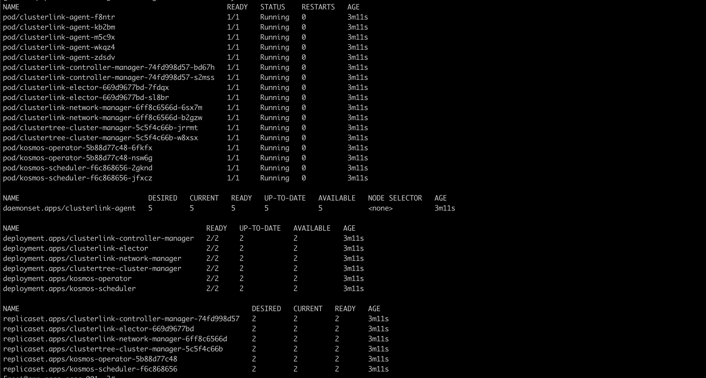
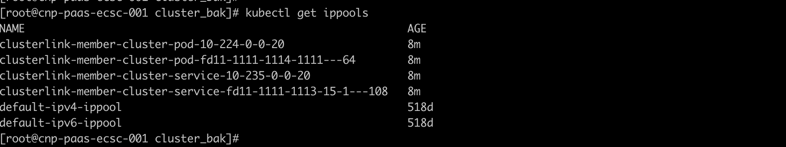
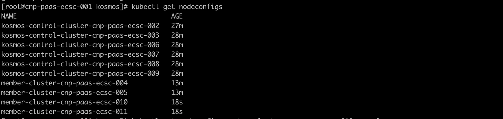
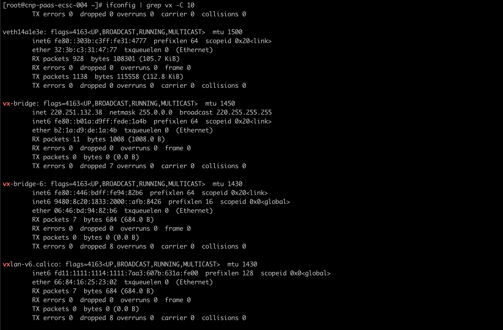

# Quick Start
This guide will cover:
- Use Kind create three kubernetes cluster
- Install `kosmos` control plane components in a Kubernetes cluster which is known as `host cluster`.
- Join a member cluster to `kosmos` control plane on the `host cluster`.
- Enabling cross-cluster deployment of applications through Kosmos.

## Prerequisites
- [Go](https://golang.org/) version v1.20+
- [kubectl](https://kubernetes.io/docs/tasks/tools/install-kubectl/) version v1.19+
- [kind](https://kind.sigs.k8s.io/) version v0.14.0+
- [helm](https://github.com/helm/helm/releases) version v3.11.0+

## Deploy and run Kosmos use script
run the following script:

```bash
git clone https://github.com/kosmos-io/kosmos.git && cd kosmos
hack/local-up-kosmos.sh
```


## Deploy and run Kosmos use `kosmosctl`

### 1. Use Kind create cluster
- Config your kind cluster use flow config, change the param as you need
```yaml
kind: Cluster
apiVersion: kind.x-k8s.io/v1alpha4
networking:
  # WARNING: It is _strongly_ recommended that you keep this the default
  # (127.0.0.1) for security reasons. However it is possible to change this.
  apiServerAddress: "192.168.200.112"
  # By default the API server listens on a random open port.
  # You may choose a specific port but probably don't need to in most cases.
  # Using a random port makes it easier to spin up multiple clusters.
  apiServerPort: 1443
nodes:
- role: control-plane
  extraPortMappings:
    - containerPort: "{{container_port}}"
      hostPort: "{{host_port}}"
      protocol: TCP
      listenAddress: "{{host_ipaddress}}"
#- role: worker
#- role: worker
```
- create cluster1

  `kind create cluster -n kind-cluster1 --config /path/to/kind-config`
- create cluster2

  `kind create cluster -n kind-cluster2 --config /path/to/kind-config`
- create cluster3

  `kind create cluster -n kind-cluster3 --config /path/to/kind-config`

### 2. Install `kosmosctl` client
Kosmos is equipped with a tool called kosmosctl, which allows for quick deployment of Kosmos components, adding clusters, and testing network connectivity.Install `kosmosctl`, you can download from the <a href="https://github.com/kosmos-io/kosmos/releases">releases page</a> or build from source

#### 2.1 Method 1：Use prebuild Binary executable file
- Download from the <a href="https://github.com/kosmos-io/kosmos/releases">releases page</a>, only support macOS and linux
- put `kosmosctl` to you Path, so you can execute `kosmosctl` without absolute path
- recommend use linux to install kosmosctl
```bash
wget -cO kosmosctl-linux-amd64 https://github.com/kosmos-io/kosmos/releases/download/v0.2.0-lts/kosmosctl-linux-amd64
chmod +x kosmosctl-linux-amd64 && sudo install -m 755 kosmosctl-linux-amd64 /usr/local/bin/kosmosctl
```
#### 2.2 Method 2：Build from source
- Download source
  `git clone https://github.com/kosmos-io/kosmos.git`
- Build code, the output file is in the` <project_dir>/_output/bin/linux/amd64/kosmosctl`
  `make kosmosctl VERSION=v0.1.9`]
- you can find any available version or tags in [here](https://github.com/kosmos-io/kosmos/tags)

### 3. Install `kosmos` control plane components
- Install the control plane in the `host cluster`. Please config the pod can access the kind cluster apiServer, avoid the `kosmos-operator` CrashLoopBackOff
```Shell
kosmosctl install  --cni calico --default-nic eth0 //We build a network tunnel based the network interface value passed by the arg default-nic
```
### 4. Cluster management
- Get the cluster2 and cluster3 kubeconfig and put it on the `host cluster`,join the two member clusters(execute on the host cluster).
```Shell
kosmosctl join cluster --name cluster2 --kubeconfig ~/kubeconfig/cluster1-kubeconfig  --cni calico --default-nic eth0  --enable-all
kosmosctl join cluster --name cluster3 --kubeconfig ~/kubeconfig/cluster2-kubeconfig  --cni calico --default-nic eth0  --enable-all
```
### 5. Check the cluster management status(Use the Kosmos clusters like single cluster on the control plane)
- check cluster nodes status
```shell
kubectl get nodes
NAME                            STATUS   ROLES           AGE   VERSION
kosmos-cluster1-control-plane   Ready    control-plane   9d    v1.27.3
kosmos-cluster2                 Ready    agent           9d    v1.27.3
kosmos-cluster3                 Ready    agent           9d    v1.27.3
```
- check cluster status
```bash
kubectl get clusters
NAME                     NETWORK_TYPE   IP_FAMILY
cluster2                 gateway        ipv4
cluster3                 gateway        ipv4
kosmos-control-cluster   gateway        ipv4
```

## Deploy and run Kosmos use `Helm`

### 1. Use Kind create cluster
- Config your kind cluster use flow config, change the param as you need
```yaml
kind: Cluster
apiVersion: kind.x-k8s.io/v1alpha4
networking:
  # WARNING: It is _strongly_ recommended that you keep this the default
  # (127.0.0.1) for security reasons. However it is possible to change this.
  apiServerAddress: "192.168.200.112"
  # By default the API server listens on a random open port.
  # You may choose a specific port but probably don't need to in most cases.
  # Using a random port makes it easier to spin up multiple clusters.
  apiServerPort: 1443
nodes:
- role: control-plane
  extraPortMappings:
    - containerPort: "{{container_port}}"
      hostPort: "{{host_port}}"
      protocol: TCP
      listenAddress: "{{host_ipaddress}}"
#- role: worker
#- role: worker
```
- create cluster1

  `kind create cluster -n kind-cluster1 --config /path/to/kind-config`
- create cluster2

  `kind create cluster -n kind-cluster2 --config /path/to/kind-config`
- create cluster3

  `kind create cluster -n kind-cluster3 --config /path/to/kind-config`

### 2. Download the Helm deployment file for `Kosmos`
- Download the source code for Kosmos

  `git clone https://github.com/kosmos-io/kosmos.git`

- Place the `kosmos` folder from the `charts` module of the source code into the `host cluster`.

### 3. Install `Kosmos` control plane components
- Install the control plane in the `host cluster`. Please config the pod can access the kind cluster apiServer, avoid the `kosmos-operator` CrashLoopBackOff,modify the configuration values in the `value.yaml` file within the downloaded `kosmos` folder (especially the ns, kubeconfig information in the main cluster, images, etc.) to meet the requirements of the current environment. For specific configuration details, refer to the comments.
```Shell
kubectl create ns kosmos-system

helm install kosmos -n kosmos-system  kosmos

```

### 4. Check the installation status of the `Kosmos` control plane components
```Shell
kubectl get all -n kosmos-system

```


### 5. Cluster management
All cluster management operations by `Kosmos` are conducted within the host cluster, and both the host and member clusters need to be managed. Managing the host cluster facilitates subsequent management operations for the member clusters, as well as the inter-cluster container network integration. Place the `cluster_yaml` folder from the deploy module in the source code into the `host cluster`.
- Manage the `host cluster`

Modify the commented content in the `kosmos-control-cluster.yaml` file within `cluster_yaml`.
```Shell
kubectl apply -f kosmos-control-cluster.yaml

```
After successfully managing the `host cluster`, check if the cluster object for the `host cluster` has been created. You can see detailed information in the cluster object, particularly noting that the status section includes new `clusterLinkStatus` information, which encompasses `podCIDRS` and `serviceCIDRS`.
```Shell
kubectl get cluster kosmos-control-cluster -oyaml

```
- Manage the `member cluster`


Modify the contents of the comments in `member-cluster.yaml` (if there are multiple member clusters, multiple files are needed) to make them fully consistent with the information in the managed subordinate clusters (including node network interface card information, etc.).
```Shell
kubectl apply -f member-cluster.yaml

```
After successfully managing the `member cluster`, check whether the cluster object in the `member cluster` has been created. You can see detailed information in the cluster object, particularly the newly added `clusterLinkStatus` information in the status section, which includes `podCIDRS` and `serviceCIDRS`.
```Shell
kubectl get cluster member-cluster -oyaml

```
Verify in the `host cluster` whether the `member clusters` are successfully managed as `virtual nodes`.
```Shell
kubectl get nodes

```
`Kosmos` supports one-to-one cluster-level management and can also manage all or some nodes within a single cluster. The mode can be modified in the cluster object.

### 6. Check after successful `Kosmos` cluster management

- `host cluster` inspection






When cross-cluster container network issues arise, whether in `p2p` mode or `gateway` mode, network troubleshooting (such as packet capturing) can be carried out on the network interfaces prefixed with `vx` created by `Kosmos`.


- `member cluster` inspection





## Deploy nginx use kosmos

### Edit the Nginx service YAML

```yaml
apiVersion: apps/v1
kind: Deployment
metadata:
  name: nginx-deployment
  labels:
    app: nginx
spec:
  replicas: 3
  selector:
    matchLabels:
      app: nginx
  template:
    metadata:
      labels:
        app: nginx
    spec:
      tolerations:
        - key: kosmos.io/node
          operator: Equal
          value: "true"
      containers:
        - name: nginx
          image: nginx:1.14.2
          ports:
            - containerPort: 80

```
### Execute Nginx service YAML
```bash
kubectl apply -f nginx-deploy.yml
```
### Check the status of Nginx service Pods

```bash
kubectl get pods -o wide
NAME                               READY   STATUS    RESTARTS   AGE   IP           NODE              NOMINATED NODE   READINESS GATES
nginx-deployment-887b5c6bb-jx9kq   1/1     Running   0          18h   10.244.0.8   kosmos-cluster3   <none>           <none>
nginx-deployment-887b5c6bb-kc9ff   1/1     Running   0          41h   10.244.0.7   kosmos-cluster2   <none>           <none>
nginx-deployment-887b5c6bb-vz8vk   1/1     Running   0          41h   10.244.0.7   kosmos-cluster3   <none>           <none>
```
To summarize, the cross-cluster deployment of the Nginx service based on Kosmos has been completed, with the service running in the member clusters