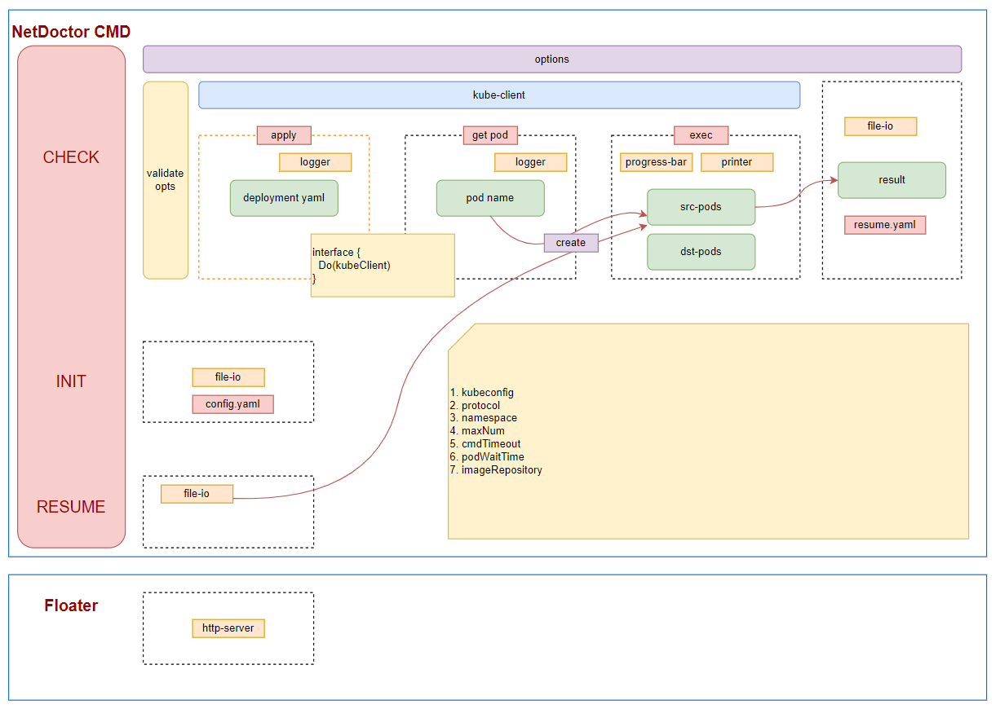

# Netdoctor

## Introduction

After the Kubernetes cluster is put into use, the cluster network may have various connectivity problems, so we hope to have an acceptance tool to check whether the network connectivity of the cluster is normal after the deployment is completed.

On the other hand, Kosmos is a cross-cluster solution. Before Kosmos manages multiple clusters, you need to check whether there are problems with the container network of each cluster itself. After the deployment is completed, you also need to verify whether the cross-cluster network has been connected by Kosmos.

For the above two aspects, we designed the [NetDoctor](https://github.com/kosmos-io/netdoctor) tool to solve network problems encountered by Kubernetes clusters.

## Architecture



## Prerequisites

* `go` version v1.15+
* `kubernetes` version v1.16+

## Quick Start

### Netctl
NetDoctor provides a supporting tool `netctl`, which allows you to easily check the network connectivity of the Kubernetes cluster through the command line.
#### From artifact
````bash
wget https://github.com/kosmos-io/netdoctor/releases/download/v0.0.1/netctl-linux-amd64 
mv netctl-linux-amd64 netctl
````
#### From source code
````bash
# Download project source code
$ git clone https://github.com/kosmos-io/netdoctor.git
# After execution, netctl will output to the ./netdoctor/_output/bin/linux/amd64 directory
$ make netctl
````
### Netctl command
#### Init
The `netctl init` command is used to generate the configuration file `config.json` required for network inspection in the current directory. The example is as follows:
+ `namespace`: The namespace where the pod is located
+ `version`: Mirror version
+ `mode`: According to the IP settings for src to dst access, `pod`, `node`, `node-to-pod`, `pod-to-node` are supported. For example, if you want to check the network connectivity from the node of src to the pod of dst, then set the mode to `node-to-pod`.
+ `protocol`: Support `tcp`, `udp`, `dns`.
+ `podWaitTime`: Time to wait for pod running
+ `port`: Pod open port
+ `maxNum`: Set the maximum number of concurrencies allowed
+ `cmdTimeout`: Timeout for command execution
+ `srcKubeConfig`: Kubeconfig of the source cluster
+ `srcImageRepository`: Mirror warehouse of the source cluster

other parameters
+ `dstKubeConfig`: Kubeconfig of the target cluster
+ `dstImageRepository`: Mirror warehouse of the target cluster
+ `autoClean`: After the check is completed, whether to automatically clean up the test pod?
+ `targetDNSServer`: Target DNS server
+ `targetHostToLookup`: TARGET DOMAIN NAME
````bash
$ netctl init
I1017 11:10:36.809902    7794 init.go:74] write opts success
$ cat config.json
{
 "namespace": "kosmos-system",
 "version": "0.3.0",
 "mode": "pod",
 "protocol": "tcp",
 "podWaitTime": 30,
 "port": "8889",
 "maxNum": 3,
 "cmdTimeout": 10,
 "srcKubeConfig": "~/.kube/config",
 "srcImageRepository": "ghcr.io/kosmos-io"
}
````
#### Check network
* `netctl check` command will read `config.json`, then create a `DaemonSet` named `Floater` and some related resources, and then obtain all the `IP` information of `Floater`, and then enter in sequence Go to `Pod` and execute the `Ping` or `Curl` command.
````bash
$ netctl check
I0205 16:34:06.147671 2769373 check.go:61] use config from file!!!!!!
I0205 16:34:06.148619 2769373 floater.go:73] create Clusterlink floater, namespace: kosmos-system
I0205 16:34:06.157582 2769373 floater.go:83] create Clusterlink floater, apply RBAC
I0205 16:34:06.167799 2769373 floater.go:94] create Clusterlink floater, version: v0.2.0
I0205 16:34:09.178566 2769373 verify.go:79] pod: clusterlink-floater-9dzsg is ready. status: Running
I0205 16:34:09.179593 2769373 verify.go:79] pod: clusterlink-floater-cscdh is ready. status: Running
Do check... 100% [================================================================================]  [0s]
+-----+----------------+----------------+-----------+-----------+
| S/N | SRC NODE NAME  | DST NODE NAME  | TARGET IP |  RESULT   |
+-----+----------------+----------------+-----------+-----------+
|   1 | ecs-net-dr-001 | ecs-net-dr-001 | 10.0.1.86 | SUCCEEDED |
|   2 | ecs-net-dr-002 | ecs-net-dr-002 | 10.0.2.29 | SUCCEEDED |
+-----+----------------+----------------+-----------+-----------+

+-----+----------------+----------------+-----------+-----------+-------------------------------+
| S/N | SRC NODE NAME  | DST NODE NAME  | TARGET IP |  RESULT   |              LOG              |
+-----+----------------+----------------+-----------+-----------+-------------------------------+
|   1 | ecs-net-dr-002 | ecs-net-dr-001 | 10.0.1.86 | EXCEPTION |exec error: unable to upgrade  |
|   2 | ecs-net-dr-001 | ecs-net-dr-002 | 10.0.2.29 | EXCEPTION |connection: container not......|
+-----+----------------+----------------+-----------+-----------+-------------------------------+
I0205 16:34:09.280220 2769373 do.go:93] write opts success
````

Things to note are:
+ Source IP address: If `mode` is `node` or `pod-to-node`, the source ip address is the Internal IP address in node.status.addresses. If `pod` or `node-to-pod`, the target ip address is the address of pod.status.pod IPs
+ Target IP address: If `mode` is `node` or `pod-to-node`, the target ip address is the Internal IP address in node.status.addresses. If `pod` or `node-to-pod`, the target ip address is the address of pod.status.pod IPs
+ If the ip address list of `pod` or `node` has both ipv 4 and ipv 6 addresses, both addresses will be checked.
+ Commands executed in different protocol modes
    + `tcp`：curl -k http:\//srcIP:dstIP/
    + `udp`：ping -c 1 %s;
    + `dns`：nslookup targetHost dnsServer; The default value of target Host is kubernetes.default.svc.cluster.local, and the default value of dns Server is coredns.

#### View inspection results
* 在`check`命令执行的过程中，会有进度条显示校验进度。命令执行完成后，会打印失败结果，并将结果保存在文件`resume.json`中。
````bash
[
 {
  "Status": 0,
  "ResultStr": "exec error: unable to upgrade connection: container not found (\"floater\"), stderr: ",
  "srcNodeName": "ecs-sealos-001",
  "dstNodeName": "ecs-sealos-002",
  "targetIP": "10.0.2.29"
 },
 {
  "Status": 0,
  "ResultStr": "exec error: command terminated with exit code 7, stderr  % Total  % Received % Xferd  Average  Speed  Time  Time  Time  Current\n  Dload  Upload  Total  Spent  Left  Speed\n\r  0  0  0  0  0  0  0  0 --:--:-- --:--:-- --:--:--  0\r  0  0  0  0  0  0  0  0 --:--:-- --:--:-- --:--:--  0\ncurl: (7) Failed to connect to 10.0.0.36 port 8889 after 0 ms: Couldn't connect to server\n",
  "srcNodeName": "ecs-sealos-002",
  "dstNodeName": "ecs-sealos-001",
  "targetIP": "10.0.0.36"
 }
]
````
#### Inter-cluster check
* If you need to check the network connectivity between any two clusters in the Kosmos cluster federation, you can add the parameters `dstKubeConfig` and `dstImageRepository` to the configuration file `config.json`, so that you can check the network connectivity between the two clusters. .

````bash
$ vim config.json
{
 "namespace": "kosmos-system",
 "version": "0.3.0",
 "mode": "pod",
 "protocol": "tcp",
 "podWaitTime": 30,
 "port": "8889",
 "maxNum": 3,
 "cmdTimeout": 10,
 "srcKubeConfig": "~/.kube/config",
 "srcImageRepository": "ghcr.io/kosmos-io"
 "dstKubeConfig": "~/.kube/dst-config",
 "dstImageRepository": "ghcr.io/kosmos-io"
}
````

#### Recheck
* `netctl resume` command is used to check only the cluster nodes with problems during the first inspection during retesting. Because there are a large number of nodes in the online environment, a single inspection may take a long time to generate results, so we hope to retest only the nodes that were abnormal in the previous inspection. The `resume` command was developed for this reason. This command will read the `resume.json` file and recheck the previous abnormal node. We can repeatedly execute this command until there are no abnormal results and then perform a full check.
````bash
$ netctl resume
I0205 16:34:06.147671 2769373 check.go:61] use config from file!!!!!!
I0205 16:34:06.148619 2769373 floater.go:73] create Clusterlink floater, namespace: kosmos-system
I0205 16:34:06.157582 2769373 floater.go:83] create Clusterlink floater, apply RBAC
I0205 16:34:06.167799 2769373 floater.go:94] create Clusterlink floater, version: v0.2.0
I0205 16:34:09.178566 2769373 verify.go:79] pod: clusterlink-floater-9dzsg is ready. status: Running
I0205 16:34:09.179593 2769373 verify.go:79] pod: clusterlink-floater-cscdh is ready. status: Running
Do check... 100% [================================================================================]  [0s]
+-----+----------------+----------------+-----------+-----------+
| S/N | SRC NODE NAME  | DST NODE NAME  | TARGET IP |  RESULT   |
+-----+----------------+----------------+-----------+-----------+
|   1 | ecs-net-dr-002 | ecs-net-dr-001 | 10.0.1.86 | SUCCEEDED |
|   2 | ecs-net-dr-001 | ecs-net-dr-002 | 10.0.2.29 | SUCCEEDED |
+-----+----------------+----------------+-----------+-----------+
````

#### clean
* `netctl clean` command is used to clean up all resources created by `NetDoctor`.
