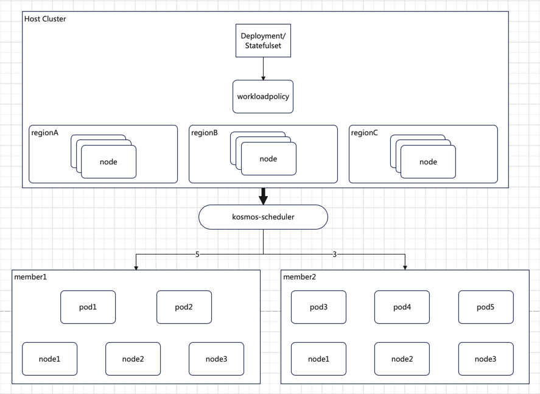
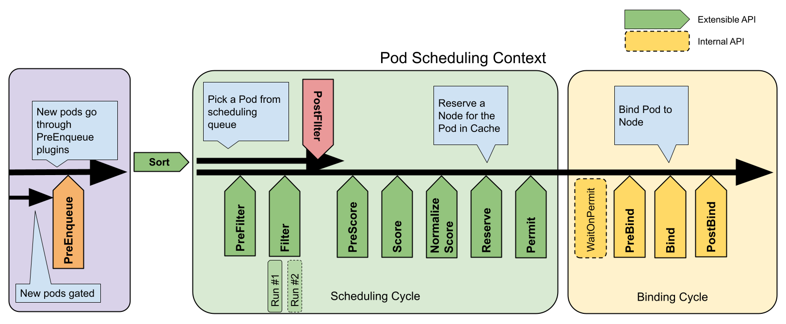
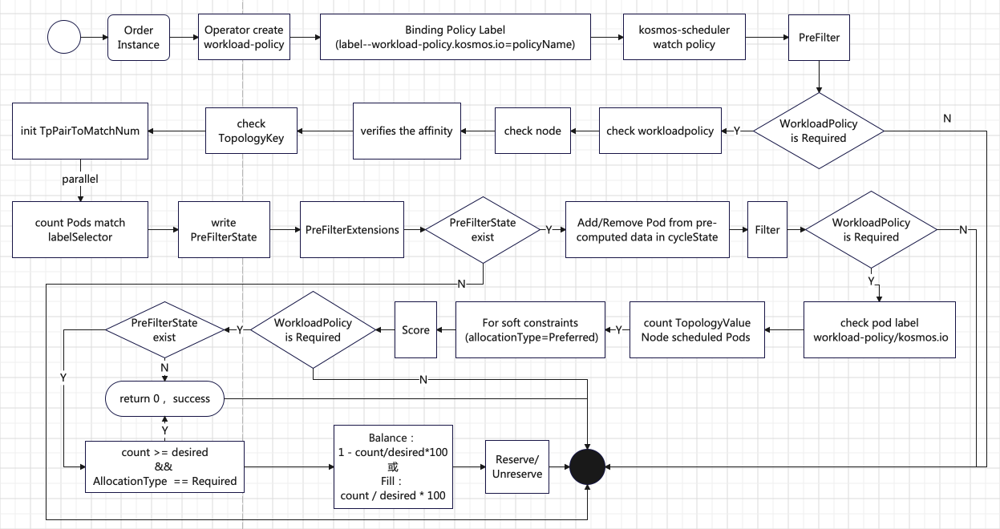

# Workloadpolicy Plugin

## Introduction

#### **What is Workloadpolicy Plugin?**
K8s topologySpreadConstraint helps schedule pods with desired skew, but it can not solve the issue: schedule desired replicas to a zone, region or cluster, e.g. `Workloadpolicy` plugin will help scheduling pods cross zones, regions or clusters.

```yaml
regionA: 5 Pods
regionB: 3 Pods
```



The diagram above illustrates the distribution of 5 Pods to regionA and 3 Pods to regionB, achieving proportional distribution of instance replicas across different regions, zones, or clusters.

## Goals

Distribute to different zone, region or cluster through the scheduler according to the ratio of instance replicas..

## Non-Goals

This scheduling plugin does not currently support modifying the replica allocation ratio and then evict and reschedule.

# Design Details

## CRD API

[Code](https://github.com/kosmos-io/kosmos/pull/834) responsible for working with WorkloadPolicy CRD API will be imported in the kosmos-scheduler plugins repo. WorkloadPolicy is namespace scope.

## Function overview

The multi-cluster scheduler Kosmos-Scheduler is built on the Scheduler Framework to implement custom scheduling logic. The business logic of the WorkloadPolicy scheduling plugin is primarily reflected in the PreFilter, Filter, Score, and Reserve extension points.



## Design Details

```yaml
apiVersion: kosmos.io/v1alpha1
kind: WorkloadPolicy
metadata:
  name: workload-policy-test
  namespace: workload-test
spec:
  allocationPolicy:
    - name: member
      replicas: 2
    - name: host
      replicas: 3
  labelSelector:
    matchLabels:
      multi-cluster: "true"
  scheduleStrategy: "Fill"
  topologyKey: workload-test
```

① **topologyKey:** Specifies the key for matching node labels (required).

② **labelSelector:** Defines the labels for filtering pods (required).

③ **allocationPolicy:** Specifies the replica allocation policy (required), where **name** corresponds to the value of the label associated with the topologyKey, and **replicas** sets the number of pod replicas to be scheduled to the corresponding node.

④ **allocationType:** Specifies the type of scheduling constraint (optional), which can be either "require" or "preferred". The former enforces the scheduling constraint, while the latter prioritizes scheduling to nodes that satisfy the constraint (soft constraint). The default is "preferred".

⑤ **allocationMethod:** Specifies the scheduling method (optional), which can be either "Fill" or "Balance".  Fill, pods with the same label are scheduled in fill mode between nodes in the same topology. Balance, pods with the same label are scheduled in balance mode between nodes in the same topology. The default is "Balance".


## Business Flow



#### **① Scheduling Policy Generation and Binding**

- **α. Order Instance:** After a user creates an instance, the product Operator generates a scheduling policy CR (Custom Resource), namely the WorkloadPolicy.

- **β. Binding Policy Label:** The generated WorkloadPolicy is bound to the Deployment or StatefulSet of the specific product instance via a label (`workload-policy.kosmos.io = policyName`).

#### **② Scheduler Observation and Analysis**

- **α. kosmos-scheduler:** The multi-cluster scheduler (kosmos-scheduler) observes the scheduling requirements of the workload and analyzes the bound WorkloadPolicy CR to determine how to schedule the Pod.

#### **③ PreFilter Extension Point**

- **α. Check if WorkloadPolicy Scheduling is Required:** If WorkloadPolicy scheduling is required, the scheduler checks the integrity of the WorkloadPolicy and verifies the affinity between the Pod and the node.

- **β. Count the Number of Pods on Nodes:** The number of scheduled Pods on nodes with the `topologyKey` label is counted in parallel using multiple goroutines (these Pods must satisfy the labels set by `labelSelector`).

- **γ. Write to PreFilterState:** The statistical results are written to PreFilterState for use by subsequent extension points.

#### **④ PreFilterExtensions Extension Point**

- **α. Check PreFilterState:** If PreFilterState exists, the scheduler performs an increment/decrement operation on the statistical data within it to dynamically adjust the scheduling state.

#### **⑤ Filter Extension Point**

- **α. Check if WorkloadPolicy Scheduling is Required:** If WorkloadPolicy scheduling is required, the scheduler retrieves PreFilterState and the workload distribution policy WorkloadPolicy specified by the `workload-policy.kosmos.io` label in the Pod.

- **β. Validate Label Constraints:** The scheduler checks whether the label constraints specified in the WorkloadPolicy exist in the Pod. If not, an unschedulable event is recorded.

- **γ. Check Replica Count:** If the label constraints exist, the scheduler checks whether the Pods with the specified label constraints have already been scheduled to the nodes constrained by `topologyKey` and whether the replica count has reached the specified number.

    - **Replica Count Reached:** For strong constraints (`allocationType=Required`), an unschedulable event is recorded. For soft constraints (`allocationType=Preferred`), the process proceeds to the next extension point.

    - **Replica Count Not Reached:** The process proceeds to the next extension point.

#### **⑥ Score Extension Point**

- **α. Check if WorkloadPolicy Scheduling is Required:** If WorkloadPolicy scheduling is required, the scheduler retrieves PreFilterState.

- **β. Scoring Logic:**

    - If the number of scheduled Pods has reached the value specified by the policy and the constraint type is strong (`allocationType=Required`), the node score is set to 0.

    - If the number of Pod replicas has not reached the value specified by the policy, the node score is calculated based on the scheduling method (`allocationMethod`) set in the policy:

        - **Balance:** `1 - count/desired * 100`

        - **Fill:** `count / desired * 100`

#### **⑦ Reserve Extension Point**

- **α. Reserve and Unreserve Methods:** These methods are used to maintain runtime state.

    - **Reserve:** When resources on a node are reserved for a specific Pod, the scheduler notifies the plugin.

    - **Unreserve:** When resources on a node are unreserved, the scheduler notifies the plugin.

# Test plan

## Example yaml

```yaml
apiVersion: apps/v1
kind: Deployment
metadata:
  name: clusterlink-floater-mix
  namespace: workload-test
spec:
  replicas: 6
  selector:
    matchLabels:
      app: clusterlink-floater-mix
  template:
    metadata:
      labels:
        app: clusterlink-floater-mix
        workload-policy/kosmos.io: workload-policy-test
    spec:
      affinity:
        podAntiAffinity:
          requiredDuringSchedulingIgnoredDuringExecution:
          - labelSelector:
              matchLabels:
                app: clusterlink-floater-mix
            topologyKey: kubernetes.io/hostname
      hostNetwork: false
      serviceAccountName: clusterlink-floater
      schedulerName: kosmos-scheduler
      containers:
      - name: floater
        image: registry.paas/cnp/clusterlink-floater:v0.3.0
        imagePullPolicy: IfNotPresent
        command:
          - clusterlink-floater
        securityContext:
          privileged: true
        env:
          - name: "PORT"
            value: "8889"
          - name: "ENABLE_ANALYSIS"
            value: "false"
      tolerations:
      - effect: NoSchedule
        operator: Exists
      - key: CriticalAddonsOnly
        operator: Exists
      - effect: NoExecute
        operator: Exists 
```

## workload policy yaml

```yaml
apiVersion: kosmos.io/v1alpha1
kind: WorkloadPolicy
metadata:
  name: workload-policy-test
  namespace: workload-test
spec:
  allocationPolicy:
    - name: member
      replicas: 1
    - name: host
      replicas: 3
  labelSelector:
    matchLabels:
      app: clusterlink-floater-mix
  allocationType: "Required"
  allocationMethod: "Fill"
  topologyKey: workload-test
```

## schedule result

```shell
kubectl apply -f workloadpolicy.yaml
kubectl apply -f example-clusterlink-floater-deployment-mix.yaml
kubectl -n workload-test get pod -owide
NAME                                       READY   STATUS    RESTARTS   AGE   IP                NODE                 
clusterlink-floater-mix-7c4f6c7497-bbqlh   0/1     Pending   0          6s    <none>            <none>    
clusterlink-floater-mix-7c4f6c7497-hprdn   0/1     Pending   0          6s    <none>            <none>
clusterlink-floater-mix-7c4f6c7497-hx84l   1/1     Running   0          6s    fd11::a18:4465    kosmos-member-cluster     
clusterlink-floater-mix-7c4f6c7497-p4qbl   1/1     Running   0          6s    fd11::a18:8586    cnp-paas-ecsc-002    
clusterlink-floater-mix-7c4f6c7497-tn8tw   1/1     Running   0          6s    fd11::a18:776d    cnp-paas-ecsc-009
```
