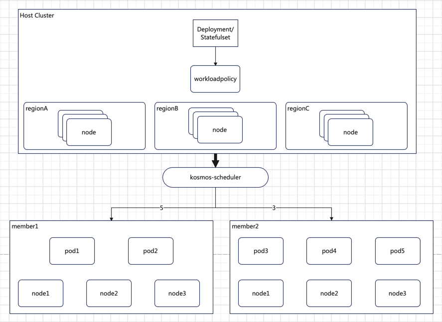

# 负载分发调度插件——Workloadpolicy

## **一、概述**

**1. 背景**

随着业务规模的扩大和分布式架构的普及，多集群管理变得愈发重要。在多集群环境下，如何合理地将工作负载分配到各个集群，以实现资源的高效利用和业务的高可用性，是亟待解决的问题。本插件的目标是提供一种灵活、高效的负载分发调度方案，满足跨域应用编排的需求。

**2. 目标**

K8s 拓扑分布约束（Topology Spread Constraints）机制虽有助于以一定偏差调度 pod，但无法满足将工作负载所需副本按需分发调度到指定区域（Region）、可用区（Zone）或集群的需求。

新增Workloadpolicy插件旨在增强调度器的跨区域、地区或集群分发工作负载 pod 的能力，填补K8s 拓扑分布约束（Topology Spread Constraints）机制这一空白。通过Workloadpolicy插件，用户可以根据自身业务需求，精确地配置工作负载在不同集群、区域的分布。例如：

```yaml
regionA: 5 Pods
regionB: 3 Pods
```



上述配置表示将 5 个 Pod 分发到 regionA，3 个 Pod 分发到 regionB，实现按实例副本比例在不同区域、地区或集群进行分发。

**3. 非目标**

本调度插件当前不支持修改副本分配比例后进行驱逐和重新调度。后续版本可考虑将此功能纳入优化计划，以满足更复杂的业务场景需求。

## **二、详细设计**

**1. CRD API**

[WorkloadPolicy CRD API](https://github.com/kosmos-io/kosmos/pull/834) 的代码将被导入到 kosmos-scheduler 插件仓库。

**2. 作用域说明**

WorkloadPolicy是命名空间作用域，适用于特定命名空间内的资源调度配置。

**3. 拓展点**

多集群调度器 kosmos-scheduler 是基于 Scheduler Framework 框架实现自定义调度逻辑，而其中WorkloadPolicy 调度插件业务逻辑主要体现在PreFilter、Filter、Score、Reserve扩展点。


**4. WorkloadPolicy CRD设计**

```yaml
apiVersion: kosmos.io/v1alpha1
kind: WorkloadPolicy
metadata:
  name: workload-policy-test
  namespace: workload-test
spec:
  topologyKey: workload-test
  labelSelector:
    matchLabels:
      app: clusterlink-floater-mix
  allocationPolicy:
    - name: member
      replicas: 1
    - name: host
      replicas: 3
  allocationType: "Required"
  allocationMethod: "Fill"
```

　　**① topologyKey：** 设置匹配节点标签的 key（必选项）

　　**② labelSelector：** 设置过滤 pod 的标签（必选项）

　　**③ allocationPolicy：** 设置副本分发策略（必选项），其中 **name** 是 topologyKey 对应的标签的 value 值，**replicas** 设置调度 pod 到对应节点的副本数。

　　**④ allocationType:** 设置调度约束类型（可选项），分为 require和Preferred，前者表示强制满足调度约束；后者表示优先调度到满足约束的节点（软约束）。默认Preferred。

　　**⑤ allocationMethod：** 设置调度方式（可选项），分为 Fill 和 Balance，前者表示同拓扑节点之间，同 label Pod 填压模式调度；后者表示同拓扑节点之间，同 label Pod 均衡模式调度。默认Balance。


**5. 流程**


　　**① 调度策略的生成与绑定**

　　　　**α．产品订购实例：** 用户创建实例后，产品 Operator 会生成一个调度策略 CR（Custom Resource），即 WorkloadPolicy。

　　　　**β．绑定策略标签：** 生成的 WorkloadPolicy 会通过标签（workload-policy.kosmos.io = policyName）绑定到具体产品实例的 Deployment 或 StatefulSet 上。

　　**② 调度器的观察与分析**

　　　　**α．kosmos-scheduler：**　多集群调度器（kosmos-scheduler）观察到工作负载的调度需求后，会分析绑定的 WorkloadPolicy CR，以确定如何调度 Pod。

　　**③ PreFilter 扩展点**

　　　　**α．检查是否需要负载调度：**　如果需要负载调度，调度器会检查 WorkloadPolicy 的完整性，并验证 Pod 和节点的亲和性 。

　　　　**β．统计节点上的 Pod 数量：**　通过多协程并行统计具有 topologyKey 标签的节点上已调度的 Pod 数量（这些 Pod 需要满足 labelSelector 设置的标签）。

　　　　**γ． 写入 PreFilterState：**　统计结果会被写入 PreFilterState，供后续扩展点使用。

　　**④ PreFilterExtensions 扩展点**

　　　　**α．检查 PreFilterState：**　如果存在 PreFilterState，调度器会对其中统计的数据进行加/减 1 的操作，以动态调整调度状态。

　　**⑤ Filter 扩展点**

　　　　**α．检查是否需要负载调度：**　如果需要负载调度，调度器会获取 PreFilterState 和 Pod 中 workload-policy/kosmos.io 标签指定的负载分发策略 WorkloadPolicy。

　　　　**β．验证标签约束：**　检查 WorkloadPolicy 中指定的标签约束是否存在于 Pod 中。如果不存在，则记录不可调度事件。

　　　　**γ．检查副本数量：**　如果标签约束存在，调度器会检查 WorkloadPolicy 中指定的标签约束的 Pod 是否已经调度到 topologyKey 约束的节点上，并且副本数是否达到指定数量。

　　　　　　**Ⅰ．达到指定数量：**　对于强约束（allocationType=Required），记录不可调度事件。对于软约束（allocationType=Preferred），则进入下一扩展点。

　　　　　　**Ⅱ．未达到指定数量：**　则进入下一扩展点。

　　**⑥　Score 扩展点**

　　　　**α．检查是否需要负载调度：**　如果需要负载调度，调度器会获取 PreFilterState。

　　　　**β．评分逻辑：**

　　　　　　Ⅰ．Pod 已调度数达到策略指定值，并且约束类型为强约束（allocationType = Required），则将节点评分设为 0。

　　　　　　Ⅱ．Pod 副本数未达到策略指定值，则根据策略设定的调度方式（allocationMethod）计算节点评分：

　　　　　　　　- **Balance：**　1 - count/desired \* 100

　　　　　　　　- **Fill：**　count / desired \* 100

　　**⑦　Reserve 扩展点**

　　　　**α．Reserve 和 Unreserve 方法：**　这两个方法用于维护运行时状态。

　　　　　　- **Reserve：**　在节点上的资源被保留给特定 Pod 时，调度器会通知插件。

　　　　　　- **Unreserve：**　在节点上的资源被解除保留时，调度器会通知插件。

## **三、部署**
**1. 前提准备**

首先，需要成功部署Kosmos(至少部署好 clustertree 模块），正确纳管子集群。

**2. 部署 kosmos scheduler 服务**

```yaml
# 1. 注入之定义 CRD
kubectl create -f kosmos.io_clusterdistributionpolicies.yaml
kubectl  create -f kosmos.io_distributionpolicies.yaml
kubectl  create -f kosmos.io_workloadpolicies.yaml
kubectl create ns kosmos-system

# 2. 配置调度器启动插件（scheduler-config.yaml）
---
apiVersion: v1
kind: ConfigMap
metadata:
  name: scheduler-config
  namespace: kosmos-system
data:
  scheduler-config.yaml: |
    apiVersion: kubescheduler.config.k8s.io/v1beta1
    kind: KubeSchedulerConfiguration
    leaderElection:
      leaderElect: true
      resourceName: kosmos-scheduler
      resourceNamespace: kosmos-system
    profiles:
      - schedulerName: kosmos-scheduler
        plugins:
          preFilter:
            disabled:
              - name: "VolumeBinding"
            enabled:
              - name: "LeafNodeVolumeBinding"
              - name: "LeafNodeWorkloadPolicy"
          filter:
            disabled:
              - name: "VolumeBinding"
              - name: "TaintToleration"
            enabled:
              - name: "LeafNodeTaintToleration"
              - name: "LeafNodeVolumeBinding"
              - name: "LeafNodeDistribution"
              - name: "LeafNodeWorkloadPolicy"
          score:
            disabled:
              - name: "VolumeBinding"
            enabled:
              - name: "LeafNodeWorkloadPolicy"
          reserve:
            disabled:
              - name: "VolumeBinding"
            enabled:
              - name: "LeafNodeVolumeBinding"
              - name: "LeafNodeWorkloadPolicy"
          preBind:
            disabled:
              - name: "VolumeBinding"
            enabled:
              - name: "LeafNodeVolumeBinding"
        pluginConfig:
          - name: LeafNodeVolumeBinding
            args:
              bindTimeoutSeconds: 5
          - name: LeafNodeDistribution
            args:
            # kubeConfigPath: "REPLACE_ME_WITH_KUBE_CONFIG_PATH"
              kubeConfigPath: "/etc/kubernetes/kubeconfig"
          - name: LeafNodeWorkloadPolicy
            args:
            # kubeConfigPath: "REPLACE_ME_WITH_KUBE_CONFIG_PATH"
              kubeConfigPath: "/etc/kubernetes/kubeconfig"

# 3. 生成配置（其中，kubeconfig 文件为host集群 config）
kubectl create cm host-kubeconfig --from-file=./kubeconfig
kubectl create -f scheduler-config.yaml

# 4. 注入 （sudo /apps/bin/kubectl create -f rabc.yaml）
---
apiVersion: v1
kind: ServiceAccount
metadata:
  name: kosmos-scheduler
  namespace: kosmos-system

---
apiVersion: rbac.authorization.k8s.io/v1
kind: ClusterRoleBinding
metadata:
  name: kosmos-scheduler
subjects:
  - kind: ServiceAccount
    name: kosmos-scheduler
    namespace: kosmos-system
roleRef:
  apiGroup: rbac.authorization.k8s.io
  kind: ClusterRole
  name: kosmos-scheduler

---
apiVersion: rbac.authorization.k8s.io/v1
kind: ClusterRole
metadata:
  name: kosmos-scheduler
rules:
  - verbs:
      - get
      - list
      - watch
    apiGroups:
      - kosmos.io
    resources:
      - '*'
  - verbs:
      - create
      - patch
      - update
    apiGroups:
      - ''
      - events.k8s.io
    resources:
      - events
  - verbs:
      - create
    apiGroups:
      - coordination.k8s.io
    resources:
      - leases
  - verbs:
      - get
      - update
    apiGroups:
      - coordination.k8s.io
    resources:
      - leases
    resourceNames:
      - kosmos-scheduler
  - verbs:
      - create
    apiGroups:
      - ''
    resources:
      - endpoints
  - verbs:
      - get
      - update
    apiGroups:
      - ''
    resources:
      - endpoints
  - verbs:
      - get
      - list
      - watch
    apiGroups:
      - ''
    resources:
      - nodes
  - verbs:
      - delete
      - get
      - list
      - watch
    apiGroups:
      - ''
    resources:
      - pods
  - verbs:
      - create
    apiGroups:
      - ''
    resources:
      - bindings
      - pods/binding
  - verbs:
      - patch
      - update
    apiGroups:
      - ''
    resources:
      - pods/status
  - verbs:
      - get
      - list
      - watch
    apiGroups:
      - ''
    resources:
      - replicationcontrollers
      - services
  - verbs:
      - get
      - list
      - watch
    apiGroups:
      - apps
      - extensions
    resources:
      - replicasets
  - verbs:
      - get
      - list
      - watch
    apiGroups:
      - apps
    resources:
      - statefulsets
  - verbs:
      - get
      - list
      - watch
    apiGroups:
      - policy
    resources:
      - poddisruptionbudgets
  - verbs:
      - get
      - list
      - watch
      - update
    apiGroups:
      - ''
    resources:
      - persistentvolumeclaims
      - persistentvolumes
  - verbs:
      - create
    apiGroups:
      - authentication.k8s.io
    resources:
      - tokenreviews
  - verbs:
      - create
    apiGroups:
      - authorization.k8s.io
    resources:
      - subjectaccessreviews
  - verbs:
      - get
      - list
      - watch
    apiGroups:
      - storage.k8s.io
    resources:
      - '*'
  - verbs:
      - get
      - list
      - watch
    apiGroups:
      - ''
    resources:
      - configmaps
      - namespaces

# 5、启动调度器（sudo /apps/bin/kubectl create -f deployment.yaml）
apiVersion: apps/v1
kind: Deployment
metadata:
  name: kosmos-scheduler
  namespace: kosmos-system
  labels:
    component: scheduler
spec:
  replicas: 3
  selector:
    matchLabels:
      component: scheduler
  template:
    metadata:
      labels:
        component: scheduler
    spec:
      volumes:
        - name: scheduler-config
          configMap:
            name: scheduler-config
            defaultMode: 420
        - name: kubeconfig-path
          configMap:
            name: kosmos-control-config
            defaultMode: 420
      containers:
        - name: kosmos-scheduler
          image: ghcr.io/kosmos-io/scheduler:0.0.2
          command:
            - scheduler
            - --config=/etc/kubernetes/kube-scheduler/scheduler-config.yaml
          resources:
            requests:
              cpu: 200m
          volumeMounts:
            - name: scheduler-config
              readOnly: true
              mountPath: /etc/kubernetes/kube-scheduler
            - name: kubeconfig-path
              readOnly: true
              mountPath: /etc/kubernetes
          livenessProbe:
            httpGet:
              path: /healthz
              port: 10259
              scheme: HTTPS
            initialDelaySeconds: 15
            periodSeconds: 10
            failureThreshold: 3
          readinessProbe:
            httpGet:
              path: /healthz
              port: 10259
              scheme: HTTPS
      restartPolicy: Always
      dnsPolicy: ClusterFirst
      serviceAccountName: kosmos-scheduler
      serviceAccount: kosmos-scheduler

# 6、查看服务
  kubectl -n kosmos-system get pod
  NAME                                         READY   STATUS    RESTARTS   AGE
  kosmos-scheduler-8f96d87d7-swxrx             1/1     Running   0          24s
  kosmos-scheduler-8f96d87d7-wzqdk             1/1     Running   0          24s
  kosmos-scheduler-8f96d87d7-kyhqw             1/1     Running   0          24s
```

## **四、测试**

本文档主要介绍负载分发调度插件，所以当前章节只进行负载分发调度插件的测试。

**1. 测试用例**
```yaml
# 1. 用例 clusterlink-floater-deployment-mix.yaml
apiVersion: apps/v1
kind: Deployment
metadata:
  name: clusterlink-floater-mix
  namespace: workload-test
spec:
  replicas: 6
  selector:
    matchLabels:
      app: clusterlink-floater-mix
  template:
    metadata:
      labels:
        app: clusterlink-floater-mix
        workload-policy/kosmos.io: workload-policy-test
    spec:
      affinity:
        podAntiAffinity:
          requiredDuringSchedulingIgnoredDuringExecution:
          - labelSelector:
              matchLabels:
                app: clusterlink-floater-mix
            topologyKey: kubernetes.io/hostname
      hostNetwork: false
      serviceAccountName: clusterlink-floater
      schedulerName: kosmos-scheduler
      containers:
      - name: floater
        image: registry.paas/cnp/clusterlink-floater:v0.3.0
        imagePullPolicy: IfNotPresent
        command:
          - clusterlink-floater
        securityContext:
          privileged: true
        env:
          - name: "PORT"
            value: "8889"
          - name: "ENABLE_ANALYSIS"
            value: "false"
      tolerations:
      - effect: NoSchedule
        operator: Exists
      - key: CriticalAddonsOnly
        operator: Exists
      - effect: NoExecute
        operator: Exists 
```

**2. 测试-1：默认软约束均衡调度**

```yaml
# 1. 负载分发策略(workloadpolicy-example-1.yaml)
apiVersion: kosmos.io/v1alpha1
kind: WorkloadPolicy
metadata:
  name: workload-policy-test
  namespace: workload-test
spec:
  allocationPolicy:
    - name: member
      replicas: 1
    - name: host
      replicas: 3
  labelSelector:
    matchLabels:
      app: clusterlink-floater-mix
  topologyKey: workload-test
  
# 2. 测试
kubectl apply -f workloadpolicy-example-1.yaml
kubectl apply -f clusterlink-floater-deployment-mix.yaml
kubectl -n workload-test get pod -owide
NAME                                        READY   STATUS     RESTARTS   AGE   IP               NODE                 
clusterlink-floater-mix-7c4f6c7497-467wm    1/1     Running    0          57s   fd11::a18:8cd0   kosmos-cluster1      
clusterlink-floater-mix-7c4f6c7497-8lt47    1/1     Running    0          57s   fd11::a18:8582   kosmos-member-cluster
clusterlink-floater-mix-7c4f6c7497-b29ft    1/1     Running    0          57s   fd11::a18:b119   cnp-paas-ecsc-002    
clusterlink-floater-mix-7c4f6c7497-gvwjg    1/1     Running    0          57s   fd11::a18:7774   cnp-paas-ecsc-006    
clusterlink-floater-mix-7c4f6c7497-mf2xd    1/1     Running    0          57s   fd11::a18:178a   cnp-paas-ecsc-009    
clusterlink-floater-mix-7c4f6c7497-x6llq    1/1     Running    0          57s   fd11::a18:3c5b   cnp-paas-ecsc-008       
```

**3. 测试-2：硬约束填压调度**

```yaml
# 1. 负载分发策略(workloadpolicy-example-2.yaml)
apiVersion: kosmos.io/v1alpha1
kind: WorkloadPolicy
metadata:
  name: workload-policy-test
  namespace: workload-test
spec:
  allocationPolicy:
    - name: member
      replicas: 1
    - name: host
      replicas: 3
  labelSelector:
    matchLabels:
      app: clusterlink-floater-mix
  allocationType: "Required"
  allocationMethod: "Fill"
  topologyKey: workload-test
  
# 2. 测试
kubectl apply -f workloadpolicy-example-2.yaml
kubectl apply -f clusterlink-floater-deployment-mix.yaml
kubectl -n workload-test get pod -owide
NAME                                       READY   STATUS    RESTARTS   AGE   IP                NODE                 
clusterlink-floater-mix-7c4f6c7497-bbqlh   0/1     Pending   0          6s    <none>            <none>    
clusterlink-floater-mix-7c4f6c7497-hprdn   0/1     Pending   0          6s    <none>            <none>
clusterlink-floater-mix-7c4f6c7497-hx84l   1/1     Running   0          6s    fd11::a18:4465    kosmos-member-cluster     
clusterlink-floater-mix-7c4f6c7497-p4qbl   1/1     Running   0          6s    fd11::a18:8586    cnp-paas-ecsc-002    
clusterlink-floater-mix-7c4f6c7497-tn8tw   1/1     Running   0          6s    fd11::a18:776d    cnp-paas-ecsc-009     
```


