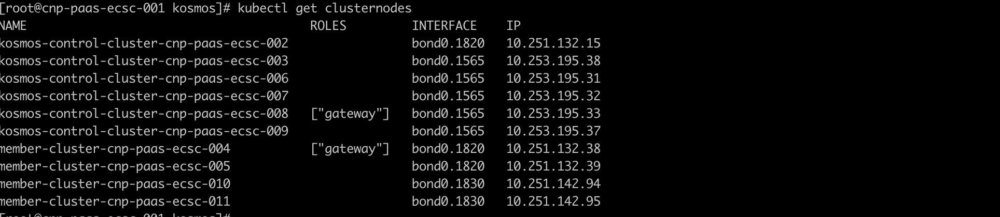
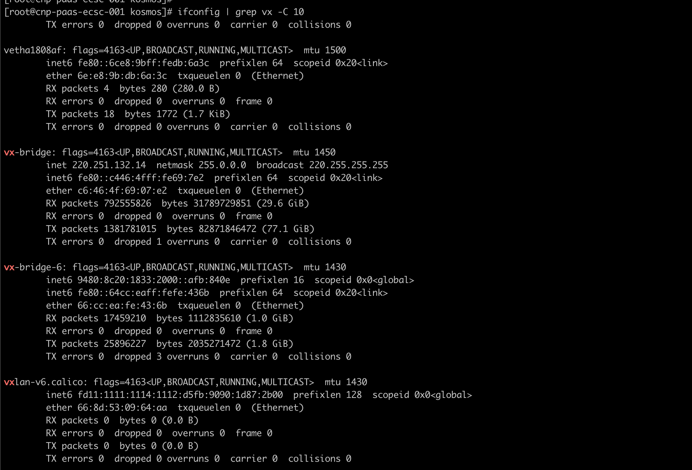
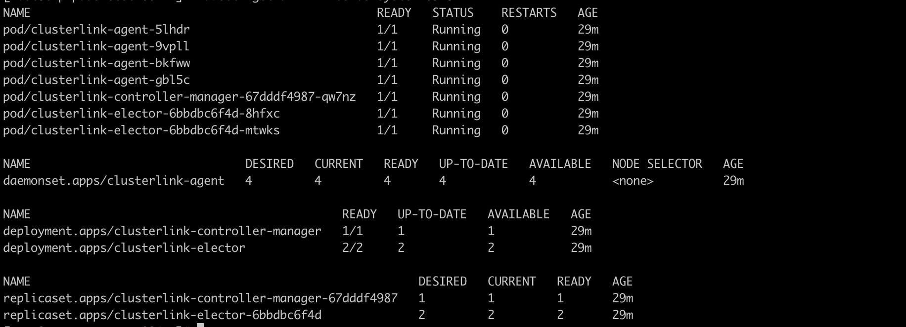
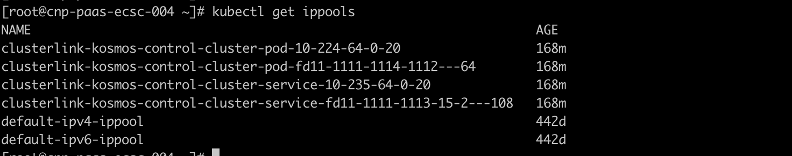

# 快速开始:
本指南涵盖了
- 通过Kind创建三套集群，一套作为`host`集群，另外两套作为`member`集群
- 在`host`集群中安装Kosmos控制面组件
- 在`host`集群中将`member`集群进行纳管
- 基于搭建完成的Kosmos环境实现应用的跨集群部署

## 前提条件
- [Go](https://golang.org/) version v1.20+
- [kubectl](https://kubernetes.io/docs/tasks/tools/install-kubectl/) version v1.19+
- [kind](https://kind.sigs.k8s.io/) version v0.14.0+
- [helm](https://github.com/helm/helm/releases) version v3.11.0+

## 通过脚本一键化部署和运行Kosmos(可选)
运行如下脚本:

```bash
git clone https://github.com/kosmos-io/kosmos.git && cd kosmos
hack/local-up-kosmos.sh
```


## 通过`kosmosctl`部署和运行Kosmos（可选）

### 1. 通过Kind创建集群
- 可参考如下配置进行Kind集群创建，具体信息可按实际情况修改
```yaml
kind: Cluster
apiVersion: kind.x-k8s.io/v1alpha4
networking:
  # WARNING: It is _strongly_ recommended that you keep this the default
  # (127.0.0.1) for security reasons. However it is possible to change this.
  apiServerAddress: "192.168.200.112"
  # By default the API server listens on a random open port.
  # You may choose a specific port but probably don't need to in most cases.
  # Using a random port makes it easier to spin up multiple clusters.
  apiServerPort: 1443
nodes:
- role: control-plane
  extraPortMappings:
    - containerPort: "{{container_port}}"
      hostPort: "{{host_port}}"
      protocol: TCP
      listenAddress: "{{host_ipaddress}}"
#- role: worker
#- role: worker
```
- 创建集群 Cluster1

  `kind create cluster -n kind-cluster1 --config /path/to/kind-config`
- 创建集群 Cluster2

  `kind create cluster -n kind-cluster2 --config /path/to/kind-config`
- 创建集群 Cluster3

  `kind create cluster -n kind-cluster3 --config /path/to/kind-config`

### 2. 安装 `kosmosctl` 客户端
Kosmosctl 是 Kosmos 的一款工具，可快速部署 Kosmos 组件、添加集群以及测试网络连接。安装 `kosmosctl`, 可通过 <a href="https://github.com/kosmos-io/kosmos/releases">发布页面</a>下载 或者从源代码进行构建。

#### 2.1 方式一：下载二进制文件
- 通过 <a href="https://github.com/kosmos-io/kosmos/releases">发布页面</a>下载, 仅支持 macOS 系统和 linux系统
- 将`kosmosctl` 客户端放置指定路径，通过配置可不通过绝对路径直接使用`kosmosctl` 客户端进行操作
- 建议在linux系统中使用`kosmosctl` 客户端
```bash
wget -cO kosmosctl-linux-amd64 https://github.com/kosmos-io/kosmos/releases/download/v0.2.0-lts/kosmosctl-linux-amd64
chmod +x kosmosctl-linux-amd64 && sudo install -m 755 kosmosctl-linux-amd64 /usr/local/bin/kosmosctl
```
#### 2.2 方式二：源码构建
- 下载Kosmos源代码
  `git clone https://github.com/kosmos-io/kosmos.git`
- 构建代码, 输出内容在` <project_dir>/_output/bin/linux/amd64/kosmosctl`
  `make kosmosctl VERSION=v0.1.9`]
- 可通过链接查到可用版本及[Tags](https://github.com/kosmos-io/kosmos/tags)

### 3. 安装 Kosmos 控制面组件
- 在 `host`集群中进行 Kosmos 控制面安装，需保证在Kind环境中Pod能够连接集群的ApiServer, 避免`kosmos-operator` 组件出现CrashLoopBackOff情况
```Shell
kosmosctl install  --cni calico --default-nic eth0 // We build a network tunnel based the network interface value passed by the arg default-nic
```
### 4. `host`集群纳管`member`集群
- 将`member`集群的所有kubeconfig文件放置在`host`集群的~/kubeconfig/目录下（亦可自行指定），通过如下命令操作纳管：
```Shell
kosmosctl join cluster --name cluster2 --kubeconfig ~/kubeconfig/cluster1-kubeconfig  --cni calico --default-nic eth0  --enable-all
kosmosctl join cluster --name cluster3 --kubeconfig ~/kubeconfig/cluster2-kubeconfig  --cni calico --default-nic eth0  --enable-all
```
### 5. 查看集群纳管情况（像使用单集群一样使用多集群）
- 查看纳管集群
```shell
kubectl get nodes
NAME                            STATUS   ROLES           AGE   VERSION
kosmos-cluster1-control-plane   Ready    control-plane   9d    v1.27.3
kosmos-cluster2                 Ready    agent           9d    v1.27.3
kosmos-cluster3                 Ready    agent           9d    v1.27.3
```
- 查看集群状态
```bash
kubectl get clusters
NAME                     NETWORK_TYPE   IP_FAMILY
cluster2                 gateway        ipv4
cluster3                 gateway        ipv4
kosmos-control-cluster   gateway        ipv4
```

## 通过`Helm`部署和运行Kosmos（可选）
### 1. 通过Kind创建集群
- 可参考如下配置进行Kind集群创建，具体信息可按实际情况修改
```yaml
kind: Cluster
apiVersion: kind.x-k8s.io/v1alpha4
networking:
  # WARNING: It is _strongly_ recommended that you keep this the default
  # (127.0.0.1) for security reasons. However it is possible to change this.
  apiServerAddress: "192.168.200.112"
  # By default the API server listens on a random open port.
  # You may choose a specific port but probably don't need to in most cases.
  # Using a random port makes it easier to spin up multiple clusters.
  apiServerPort: 1443
nodes:
- role: control-plane
  extraPortMappings:
    - containerPort: "{{container_port}}"
      hostPort: "{{host_port}}"
      protocol: TCP
      listenAddress: "{{host_ipaddress}}"
#- role: worker
#- role: worker
```
- 创建集群 Cluster1

  `kind create cluster -n kind-cluster1 --config /path/to/kind-config`
- 创建集群 Cluster2

  `kind create cluster -n kind-cluster2 --config /path/to/kind-config`
- 创建集群 Cluster3

  `kind create cluster -n kind-cluster3 --config /path/to/kind-config`

### 2. Kosmos 的 Helm 部署文件下载
- 下载Kosmos源代码

  `git clone https://github.com/kosmos-io/kosmos.git`

- 将源代码中charts模块的kosmos文件夹放置`host`集群中

### 3. 安装 Kosmos 控制面组件
- 在 `host`集群中进行 Kosmos 控制面安装，需保证在Kind环境中Pod能够连接集群的ApiServer, 避免`kosmos-operator` 组件出现CrashLoopBackOff情况,修改上述下载的kosmos文件夹中value.yaml中的配置值(特别是ns、主集群中kubeconfig信息、镜像等)，使配置值符合当前环境要求，具体配置信息见注释;
```Shell
kubectl create ns kosmos-system

helm install kosmos -n kosmos-system  kosmos

```

### 4. 查看 Kosmos 控制面组件安装情况
```Shell
kubectl get all -n kosmos-system

```


### 5. Kosmos纳管集群
Kosmos纳管集群操作均在 `host`集群中进行，需要分别对`host`集群、`member`集群均纳管，纳管`host`集群便于后续纳管`member`集群管理操作及跨集群容器网络打通工作，将源代码中deploy模块的cluster_yaml文件夹放置`host`集群中
- 纳管`host`集群

修改cluster_yaml中kosmos-control-cluster.yaml文件中注释的内容
```Shell
kubectl apply -f kosmos-control-cluster.yaml

```
纳管`host`集群成功后，检查`host`集群cluster对象是否创建,可以看到cluster对象中详细信息，特别是看到status处有新增的clusterLinkStatus信息包括了podCIDRS和serviceCIDRS
```Shell
kubectl get cluster kosmos-control-cluster -oyaml

```
- 纳管`member`集群

修改member-cluster.yaml注释的内容（如果有多个`member`集群，需要有多个文件），使其与所纳管的子集群中的信息完全一致（包含节点网卡信息等）
```Shell
kubectl apply -f member-cluster.yaml

```
纳管`member`集群成功后，检查`member`集群cluster对象是否创建,可以看到cluster对象中详细信息，特别是看到status处有新增的clusterLinkStatus信息包括了podCIDRS和serviceCIDRS
```Shell
kubectl get cluster member-cluster -oyaml

```
在`host`集群查看`member`集群是否以虚拟节点的方式进行纳管成功
```Shell
kubectl get nodes

```
kosmos支持一对一个集群维度纳管，亦可支持一对一个集群中所有节点或者部分节点纳管，支持模式在cluster对象中修改

### 6. Kosmos集群纳管成功后检查

- `host`集群检查





当出现跨集群容器网络问题时，不管是p2p模式还是gateway模式，均可围绕kosmos创建的vx开头的网卡进行相关问题排查(抓包等方式)




- `member`集群检查







## 基于搭建的Kosmos环境部署Nginx应用

- 编辑Nginx服务Yaml

```yaml
apiVersion: apps/v1
kind: Deployment
metadata:
  name: nginx-deployment
  labels:
    app: nginx
spec:
  replicas: 3
  selector:
    matchLabels:
      app: nginx
  template:
    metadata:
      labels:
        app: nginx
    spec:
      tolerations:
        - key: kosmos.io/node
          operator: Equal
          value: "true"
      containers:
        - name: nginx
          image: nginx:1.14.2
          ports:
            - containerPort: 80

```
- 执行Nginx服务Yaml
```bash
kubectl apply -f nginx-deploy.yml
```
- 查看Nginx服务Pod状态

```bash
kubectl get pods -o wide
NAME                               READY   STATUS    RESTARTS   AGE   IP           NODE              NOMINATED NODE   READINESS GATES
nginx-deployment-887b5c6bb-jx9kq   1/1     Running   0          18h   10.244.0.8   kosmos-cluster3   <none>           <none>
nginx-deployment-887b5c6bb-kc9ff   1/1     Running   0          41h   10.244.0.7   kosmos-cluster2   <none>           <none>
nginx-deployment-887b5c6bb-vz8vk   1/1     Running   0          41h   10.244.0.7   kosmos-cluster3   <none>           <none>
```
综上，基于Kosmos进行Nginx服务实现跨集群部署完成，在子集群中运行Running