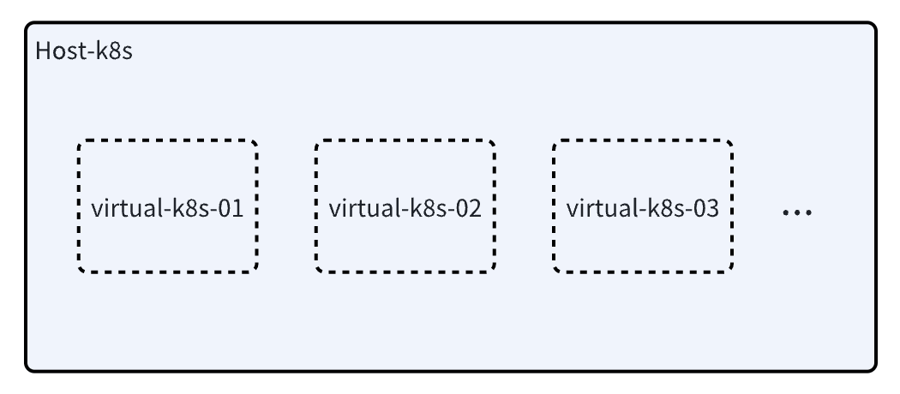

# Kubenest

## Introduction

### What is kubenest?
Kubenest is a solution that virtualizes multiple k8s clusters in a k8s cluster. The cluster that is virtualized with multiple k8s clusters is called host-k8s, 
and the virtualized cluster is called virtual-k8s, as shown in the figure below.



### Why do you need kubenest?
In some cases, cloud vendors will provide a large k8s cluster as infrastructure at the bottom layer to provide computing resources such as CPU and GPU to different tenants.
In order to achieve the isolation of permissions and data of different tenants, multiple small k8s clusters need to be virtualized in the large k8s cluster for tenants to use. 
Tenants do not perceive the existence of the large k8s cluster or other tenants, and use the virtualized k8s cluster like a normal k8s cluster. 
Based on this background, we designed kubenest.

## Solution

### Overview  

  

As shown in the above figure, when a tenant accesses a virtual cluster, they first access the api-server in the virtual control plane on the hosted large cluster (Host k8s),
expose the network externally through nodeport, and then interact with the virtual-k8s cluster created by the api-server in the virtual control plane.
Users can deploy their own services in Virtual k8s. The nodes in Virtual k8s are separated from the hosted large cluster and then joined to virtual-k8s.
Because all control plane services of k8s are installed in the control plane, metadata and network are completely isolated for tenants,
ensuring the security of their data. At the same time, due to the automated disassembly and assembly of nodes, 
tenants are provided with the ability to scale elastically in seconds on demand.  
In order to virtualize a virtual-k8s cluster in a host-k8s cluster, first, virtual-k8s needs a control plane, in which api-server, 
controller-manager, etcd, scheduler, and core-dns components need to be installed. The control plane of this virtual-k8s needs to be installed on the master node of host-k8s. 
Then, in virtual-k8s, components such as calico and kube-proxy need to be installed. Among them, api-server, controller-manager, etcd, scheduler, 
and core-dns are installed under a namespace in the host-k8s cluster, which is specified by the tenant in CustomResource when creating a virtualcluster. 
CustomResource is an entry point for the virtual control plane controller. After the control plane of virtual-k8s is installed, 
it is necessary to install the worker node of virtual-k8s. Here we consider removing the worker node in the host-k8s cluster and installing it in the virtual-k8s cluster. 
This also explains why the control plane of virtual-k8s should be installed on the master node of host-k8s, because if it is installed in the worker node, 
the subsequent disassembly and installation of the node may use this worker node. In this way, the node in virtual-k8s is actually a node in host-k8s. 
Once it is removed and installed in virtual-k8s, the get node in host-k8s cannot get the removed node. Therefore, we need a place to "store" the node information in host-k8s. 
We designed the Custom Resource Definition globalnode to synchronize label changes on host-k8s, and also store node status (such as whether it belongs to a shared cluster node and whether it is already occupied by virtual-k8s). 
When creating virtual-k8s, the controller will select nodes based on CR and globalnode.

### Architecture Diagram


#### Virtual Cluster Custom Resource
Virtual cluster CR is the API of the virtual control plane operator, which is the entrance to create a virtual control plane. 
After the upper-level service creates this CR, the virtual cluster controller performs a series of operations such as creating 
a virtual control plane, disassembling nodes, and installing components. The following information needs to be paid attention to in the CR:

- Metadata.namespace: the ns of the virtual-k8s created. This ns is the ns in host-k8s, used to create the virtual-k8s control plane in this ns
- metadata.name: Name of virtual-k8s created
- Spec.externalIP: This IP will be added to the certificate of virtual-k8s kubeconfig, and the api-server of virtual-k8s 
can be accessed externally through this IP
- promotePolicies' labelSelector: Select the label of the worker node in host-k8s, and select the node based on the node label
- promotePolicies.nodeCount: The number of selected nodes
- Spec.kubeconfig: virtual-k8s' kubeconfig, encrypted with base64. No need to fill in on the client side, backfill to CR 
after the virtual-k8s virtual control plane is created
- Status.phase: The state created by the virtual control plane that does not need to be filled in on the client side. 
It is also the state monitored by the two controllers of the virtual control plane and the disassembly node, and the corresponding 
logic is processed according to this state

An example of CR is as follows:
```yaml
apiVersion: kosmos.io/v1alpha1
kind: VirtualCluster
metadata:
  namespace: test-521-8
  name: test-521-8
spec:
  externalIP: "192.168.0.1"  #dummy ip
  promotePolicies:
    - labelSelector:
         matchLabels:
           kubernetes.io/hostname: kc-aaaaa-s-x6fn2
      nodeCount: 1
```

#### Virtual Cluster Controller
The virtual cluster controller is used to listen to the virtual cluster CR, create a virtual control plane for virtual-k8s, 
disassemble worker nodes, install components in virtual-k8s, and perform a series of operations. 
This controller is divided into three specific controllers based on its functions.
- GlobalNodeController: Used to listen to the node node and update the label value on the node. At the same time, 
maintain the disassembled state of the node. This information is needed in the CR created by the upper layer service
- VirtualClusterInitController: Create a virtual control plane. After creating the virtual control plane, 
wait for the node to be added to the virtual cluster, and then start installing the components
- NodeController: listens to the virtual cluster CR, and performs the operation of disassembling and assembling nodes 
when the virtual control plane is ready.

#### Node-agent
In order to automate node disassembly and provide on-demand second-level elastic scalability, 
we have developed a node-agent that can operate nodes through websocket without logging in to the node through ansible or ssh. 
We will install an agent on the node, which is a remote operator executor. 
The Virtual Cluster Controller implements some operations on the worker-node by calling the agent's interface, 
deploys the systemd service through daemonset, and needs to escape to the host user to execute the installation command. 
The flowchart of the node joining virtual-k8s is shown in the figure below. The dotted line part is the capability provided 
by the node-agent.


## How to use
We defined the Virtual Cluster through the k8s CRD. Therefore, from a usage perspective, we only need to issue a CR, 
and the controller will create virtual-k8s based on the issued CR. At the same time, after the control plane is successfully installed, 
the kubeconfig file will be rewritten back to the CR. After the user obtains the kubeconfig, 
they can access the virtual-k8s cluster through base64 decryption. A complete CR is shown in the following figure.


## Technical advantages
- Security isolation: tenant metadata and network are completely isolated to ensure tenant security
- Second-level elastic expansion: quickly pull up the tenant control surface, providing node on-demand second-level elastic expansion
- Efficient operation and maintenance: Create control surfaces through Cloud Native CRE to ensure that management does not interfere with existing resources

## Differences from standard k8s
- Because the virtual-k8s control plane is hosted in host-k8s, the tenant cannot change the configuration of the k8s system service
- The tenant's k8s control plane service is deployed in a k8s cluster mixed with other tenants, and is isolated by an exclusive etcd at the logical level
- Control plane services are isolated from container networks on tenant nodes
- The control plane service is exposed through the nodeport of host-k8s, and the tenant service is exposed through the nodeport of the node on virtual-k8s