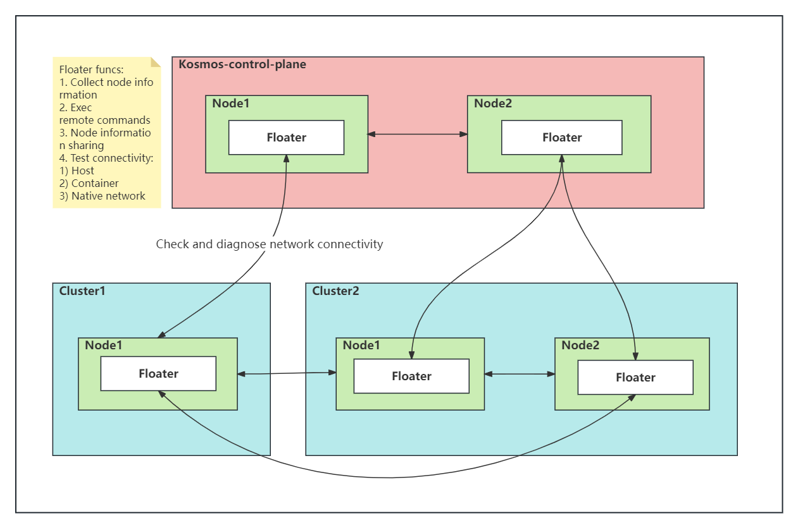

# Multi-cluster Network Connectivity
The Clusterlink design of the Kosmos multi-cluster solution aims to interconnect the nodes and resources of multiple Kubernetes clusters, forming a unified resource pool. 
One of the foundations for achieving this is the need to build a multi-cluster network architecture to meet the communication requirements between different clusters.

## Multi-cluster Container Network Solution

### Introduction
Clusterlink includes two network modes: Gateway and P2P. In the Gateway mode, when a data packet is sent by a Pod on the left, it first goes through the vx-local tunnel within the cluster to reach the Gateway node of that cluster. 
It then traverses the cross-cluster tunnel to reach the counterpart cluster. 
Once the data packet arrives at the counterpart cluster, it is handled by the CNI and follows the single-cluster network to reach the target Pod. 
This mode has its advantages and disadvantages. 
The advantage is that each cluster only needs one node (or two for high availability) to provide external access, making it suitable for multi-cloud and hybrid cloud scenarios. 
The disadvantage is that due to the longer network path, there is a certain performance loss. 
To address this issue, Clusterlink provides the P2P mode, which is suitable for scenarios with higher network performance requirements. 
In this mode, the data packets are directly sent to the node where the counterpart Pod is located. 
Additionally, the P2P and Gateway modes can be used in combination.

### Design
The architecture of the Kosmos multi-cluster network Gateway solution is as follows:


:::info NOTE
It provides strong compatibility, requiring only one node per cluster (or two for high availability) to provide external access, making it suitable for cross-cloud scenarios.
:::

The architecture of the Kosmos multi-cluster network P2P solution is as follows:


:::info NOTE
It has shorter network paths and better performance, making it suitable for fully interconnected Underlay scenarios.
:::

### Prerequisites

#### Install Kosmos
Refer to the Kosmos Quick Start documentation https://github.com/kosmos-io/kosmos and enable the ClusterLink module for multi-cluster networking. Using the kosmosctl tool:
````shell script
kosmosctl install --cni calico --default-nic eth0 (We build a network tunnel based on the network interface value passed by the arg "default-nic")
````

#### Join the Leaf Cluster
````shell script
kosmosctl join cluster --name cluster1 --kubeconfig ~/kubeconfig/cluster1-kubeconfig --cni calico --default-nic eth0 --enable-link
````

### Across Cluster L3 Network Connectivity
To achieve cross-cluster L3 network connectivity in Kosmos, at least two different cluster nodes from each cluster need to be able to communicate with each other at the host machine network level, and the clusters must be correctly deployed and support VXLAN or IPSec technologies.

#### Gateway Mode
In each Kubernetes cluster within the Kosmos federation, one node is elected as the Gateway (GW) node using the Elector module. 
The GW nodes of the two clusters communicate through the vx-bridge tunnel (created by Kosmos) to establish connectivity. 
Within each cluster, routing is handled by the GW node. 
Compared to the P2P mode, the GW mode has slightly lower network performance due to the additional packet encapsulation and decapsulation at the GW node. 
However, the advantage is that the routing table and FDB table of the cluster nodes can remain almost the same as before. 
Therefore, the GW mode is suitable for larger-scale multi-cluster scenarios where network performance is not critical.

#### P2P Mode
In the P2P mode, there is no need to use the Elector module. 
Kosmos creates vx-bridge interfaces on all nodes of each cluster to achieve direct container network communication between nodes of different clusters. 
The network performance in this mode is almost the same as in a single Kubernetes cluster. 
However, in the P2P mode, every node in the cluster needs to configure access rules for all nodes in the Kosmos federation, resulting in larger routing and FDB table sizes. 
Therefore, the P2P mode is suitable for scenarios that require higher network performance but have a smaller number of nodes in each cluster.

### Starting ClusterLink

#### Using P2P Mode
````shell script
# Complete the steps in sections 'Install Kosmos' & 'Join the Leaf Cluster'
# Check if the clusters resource has been created correctly
[root@kosmos-control-cluster yaml]# kubectl --kubeconfig config-14 get clusters.kosmos.io
NAME                     NETWORK_TYPE   IP_FAMILY
cluster38                p2p            all
kosmos-control-cluster   p2p            all

# Check if the clusternodes resource has been created correctly
[root@kosmos-control-cluster yaml]# kubectl get clusternodes.kosmos.io
NAME                         ROLES         INTERFACE    IP
cluster38-001                              bond0.1820   10.*.*.38
cluster38-002                              bond0.1820   10.*.*.39
cluster38-003                              bond0.1830   10.*.*.94
cluster38-004                ["gateway"]   bond0.1830   10.*.*.95
kosmos-control-cluster-001                 bond0.1820   10.*.*.14
kosmos-control-cluster-002                 bond0.1820   10.*.*.15
kosmos-control-cluster-003   ["gateway"]   bond0.1565   10.*.*.38
kosmos-control-cluster-004                 bond0.1565   10.*.*.31
kosmos-control-cluster-005                 bond0.1565   10.*.*.32
kosmos-control-cluster-006                 bond0.1565   10.*.*.33
kosmos-control-cluster-007                 bond0.1565   10.*.*.37

# Check if the nodeconfigs resource has been created correctly
[root@kosmos-control-cluster yaml]# kubectl get nodeconfigs.kosmos.io
NAME                         AGE
cluster38-001                14d
cluster38-002                14d
cluster38-003                14d
cluster38-004                14d
kosmos-control-cluster-001   48d
kosmos-control-cluster-002   48d
kosmos-control-cluster-003   49d
kosmos-control-cluster-004   49d
kosmos-control-cluster-005   45d
kosmos-control-cluster-006   45d
kosmos-control-cluster-007   45d
````

#### Create Test Pods
Verify the cross-cluster container network connectivity by creating Pods in the kosmos-control-cluster and cluster38 clusters. 
To ensure the containers have common network utilities such as Ping and Curl, use the clusterlink-floater image. 
More details about the Floater feature will be provided in subsequent sections. Here is a sample YAML to create the Pods:
````shell script
---
apiVersion: v1
kind: ServiceAccount
metadata:
  name: clusterlink-floater
  namespace: kosmos-system
---
apiVersion: rbac.authorization.k8s.io/v1
kind: ClusterRole
metadata:
  name: clusterlink-floater
rules:
  - apiGroups: ['*']
    resources: ['*']
    verbs: ["*"]
  - nonResourceURLs: ['*']
    verbs: ["get"]
---
apiVersion: rbac.authorization.k8s.io/v1
kind: ClusterRoleBinding
metadata:
  name: clusterlink-floater
roleRef:
  apiGroup: rbac.authorization.k8s.io
  kind: ClusterRole
  name: clusterlink-floater
subjects:
  - kind: ServiceAccount
    name: clusterlink-floater
    namespace: kosmos-system
---
apiVersion: apps/v1
kind: Deployment
metadata:
  name: clusterlink-floater
  namespace: kosmos-system
spec:
  replicas: 1
  selector:
    matchLabels:
      app: clusterlink-floater
  template:
    metadata:
      labels:
        app: clusterlink-floater
    spec:
      hostNetwork: false
      serviceAccountName: clusterlink-floater
      containers:
      - name: floater
        image: ghcr.io/kosmos-io/clusterlink-floater:v0.2.0-lts
        imagePullPolicy: IfNotPresent
        command:
          - clusterlink-floater
        securityContext:
          privileged: true
        env:
          - name: "PORT"
            value: "8889"
          - name: "ENABLE_ANALYSIS"
            value: "false"
      affinity:
        nodeAffinity:
          requiredDuringSchedulingIgnoredDuringExecution:
            nodeSelectorTerms:
              - matchExpressions:
                - key: kosmos.io/exclude
                  operator: DoesNotExist
      tolerations:
      - effect: NoSchedule
        operator: Exists
      - key: CriticalAddonsOnly
        operator: Exists
      - effect: NoExecute
        operator: Exists
````

:::info NOTE
The provided test case in this section can only check the container network connectivity between nodes in two clusters. 
To quickly test all nodes in the cluster, please refer to section 5.
:::

Make sure the Pods are running successfully in the kosmos-control-cluster and cluster38 clusters: 
````shell script
[root@kosmos-control-cluster yaml]# kubectl -n kosmos-system get pod
NAME                                              READY   STATUS    RESTARTS   AGE
clusterlink-agent-6qq4v                           1/1     Running   0          15d
clusterlink-agent-6v9jm                           1/1     Running   0          15d
clusterlink-agent-7zpf5                           1/1     Running   0          15d
clusterlink-agent-84d68                           1/1     Running   0          15d
clusterlink-agent-dj9q2                           1/1     Running   0          26h
clusterlink-agent-r2zj4                           1/1     Running   0          15d
clusterlink-agent-vlh2x                           1/1     Running   0          3d3h
clusterlink-controller-manager-6774ddd58b-bcn7s   1/1     Running   0          15d
clusterlink-elector-6b597b44f7-jrbg6              1/1     Running   0          15d
clusterlink-elector-6b597b44f7-mj882              1/1     Running   0          15d
clusterlink-floater-7dcb47579-lddgc               1/1     Running   0          77s
clusterlink-network-manager-6489597986-h74m4      1/1     Running   0          15d
clustertree-cluster-manager-6778bd7b6c-mwhpj      1/1     Running   0          5h45m
kosmos-operator-c88898f66-b8mjl                   1/1     Running   0          15d
kosmos-scheduler-7dcfd94bf7-2km8m                 1/1     Running   0          8d

[root@cluster38 yaml]# kubectl -n kosmos-system get pod
NAME                                              READY   STATUS    RESTARTS   AGE
clusterlink-agent-jsv2b                           1/1     Running   0          14d
clusterlink-agent-qncxt                           1/1     Running   0          14d
clusterlink-agent-rzngm                           1/1     Running   0          14d
clusterlink-agent-s252r                           1/1     Running   0          14d
clusterlink-controller-manager-77fbbd9f78-bz47t   1/1     Running   0          14d
clusterlink-elector-86b49775b5-x4gsp              1/1     Running   0          14d
clusterlink-elector-86b49775b5-z4lb5              1/1     Running   0          14d
clusterlink-floater-7dcb47579-jx85c               1/1     Running   0          16s
````

Get the IP addresses of the two Pods and enter the container of either Pod to execute the Ping command to verify the inter-cluster container network connectivity. 
Here is an example:
````shell script
[root@cluster38 yaml]# kubectl -n kosmos-system get pod clusterlink-floater-7dcb47579-jx85c -oyaml |grep ip
  - ip: 10.*.*.253
  - ip: fd11:1111:*:*:*:*:4573:f17d

[root@kosmos-control-cluster yaml]# kubectl -n kosmos-system exec -it clusterlink-floater-7dcb47579-lddgc -- sh
/ # ping 10.*.*.253
PING 10.*.*.253 (10.*.*.253): 56 data bytes
64 bytes from 10.*.*.253: seq=0 ttl=62 time=0.592 ms
64 bytes from 10.*.*.253: seq=1 ttl=62 time=0.362 ms
64 bytes from 10.*.*.253: seq=2 ttl=62 time=0.388 ms
64 bytes from 10.*.*.253: seq=3 ttl=62 time=0.373 ms
^C
--- 10.*.*.253 ping statistics ---
4 packets transmitted, 4 packets received, 0% packet loss
round-trip min/avg/max = 0.362/0.428/0.592 ms
/ # ping -6 fd11:1111:*:*:*:*:4573:f17d
PING fd11:1111:*:*:*:*:4573:f17d (fd11:1111:*:*:*:*:4573:f17d): 56 data bytes
64 bytes from fd11:1111:*:*:*:*:4573:f17d: seq=0 ttl=62 time=0.679 ms
64 bytes from fd11:1111:*:*:*:*:4573:f17d: seq=1 ttl=62 time=0.492 ms
64 bytes from fd11:1111:*:*:*:*:4573:f17d: seq=2 ttl=62 time=0.406 ms
64 bytes from fd11:1111:*:*:*:*:4573:f17d: seq=3 ttl=62 time=1.488 ms
^C
--- fd11:1111:*:*:*:*:4573:f17d ping statistics ---
4 packets transmitted, 4 packets received, 0% packet loss
round-trip min/avg/max = 0.406/0.766/1.488 ms
````

### One-Click Diagnostic for Cluster Connectivity
The Cluster Connectivity Diagnostic (Floater) feature was developed to address the challenge of continuously checking the network connectivity between multiple Kubernetes clusters when using Kosmos. 
When the number of clusters is small, such as only two clusters, this task may not be difficult. 
However, when the number of clusters reaches 5000 or even more, even the most enthusiastic operations personnel would find it nearly impossible to complete this task.

To address this, we designed the Floater feature, which floats on every node in a cluster. 
Through the kosmosctl tool, you can diagnose the network connectivity between multiple Kubernetes clusters with just one command.
The architecture of the ClusterLink Floater is as follows:



The kosmosctl command line tool provides a one-click diagnostic command "dr" to easily validate the network connectivity between multiple Kubernetes clusters, including but not limited to host network, container network, and native cluster network. 
Here is an example:
````shell script
# Verify cross-cluster host network
kosmosctl dr -r ghcr.io/kosmos-io/komos --src-kubeconfig root-config --dst-kubeconfig cluster38-config --host-network

# Verify cross-cluster container network
kosmosctl dr -r ghcr.io/kosmos-io/komos --src-kubeconfig root-config --dst-kubeconfig cluster38-config
````