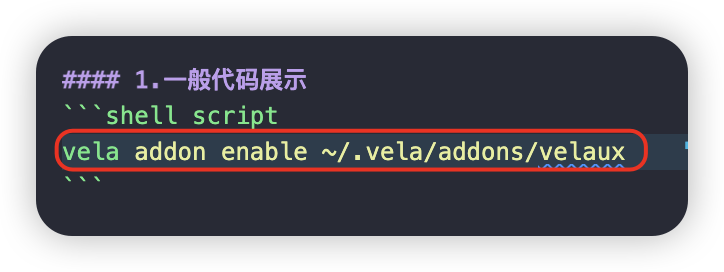
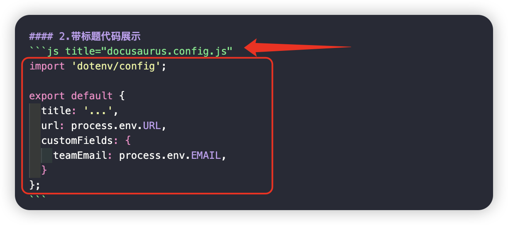

import Tabs from '@theme/Tabs';
import TabItem from '@theme/TabItem';

## 1.常见markdown写法 

这里是常见[markdown写法](https://zhuanlan.zhihu.com/p/517670740?utm_id=0)

## 2.其他可能用到的其他样式写法

### 1.图片显示


### 2.折叠显示
<details>
<summary>折叠效果</summary>
```console
这是折叠效果内容
```
</details>


### 3.常见代码编写显示

#### 1.一般代码展示
```shell script
vela addon enable ~/.vela/addons/velaux
```



#### 2.带标题代码展示
```js title="docusaurus.config.js"
import 'dotenv/config';

export default {
  title: '...',
  url: process.env.URL,
  customFields: {
    teamEmail: process.env.EMAIL,
  }
};
```



#### 3.凸显特殊行号

```yaml showLineNumbers {2,5}
kind: Application
metadata:
  name: gateway-app
spec:
  components:
    - name: comp-namespace
      type: k8s-objects
      properties:
        objects:
          - apiVersion: v1
            kind: Namespace
            metadata:
              name: test-ns1
```


### 4.tabBar切换展示显示

<Tabs>
<TabItem value="centos" label="Centos">
```bash
yum install -y java-1.8.0-openjdk unzip
```
</TabItem>

<TabItem value="ubuntu" label="Ubuntu">
```bash
apt update
apt install -y openjdk-8-jre-headless unzip
```
</TabItem>
</Tabs>


### 5.说明显示

#### 1.信息说明

:::info 说明
这里就是信息说明:
凸显文字可以用`特殊符合`
:::

#### 2.tip信息

:::tip tip
这里就是tip说明:
凸显文字可以用`特殊符合`
:::

#### 3.警告信息

:::caution
这里就是警告说明:
凸显文字可以用`特殊符合`
:::

#### 4.备注信息

:::note
这里就是备注说明:
凸显文字可以用`特殊符合`
:::


### 6.说明文字显示

> 说明文件,可以加上链接


### 7.表格显示

|        应用        |   工作流   |                             说明                              |
| :----------------: | :--------: | :-----------------------------------------------------------: |
|  runningWorkflow   | executing  |       当工作流正在执行时，应用的状态为 runningWorkflow        |
| workflowSuspending | suspending |        当工作流暂停时，应用的状态为 workflowSuspending        |
| workflowTerminated | terminated |       当工作流被终止时，应用的状态为 workflowTerminated       |
|   workflowFailed   |   failed   | 当工作流执行完成，且有步骤失败时，应用的状态为 workflowFailed |
|      running       | succeeded  |     当工作流中所有步骤都成功执行后，应用的状态为  running     |


### 8.gif支持


