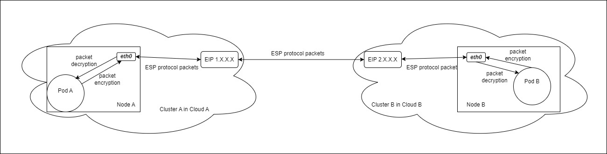

# IPsec跨集群容器网络解决方案

## 使用IPsec隧道在公共IP上进行跨集群容器网络通信

### 简介
Kosmos是一个多集群解决方案，网络是其重要组成部分。
有时候，需要在不同网络的Kubernetes集群之间进行通信。
在某些情况下，两个或多个集群只能通过公共互联网进行通信。
为了解决这个问题，Kosmos实现了基于IPsec隧道的跨集群容器网络通信解决方案。

### 动机
出于灾难恢复的考虑，应用部署可能需要在多云多集群环境的不同区域（跨VPC）之间进行通信。
在这种情况下，由于机器的内部IP地址通常无法直接访问而没有专用网络连接，容器通信变得具有挑战性。
常见的CNI隧道技术如VxLAN或IPIP在公共互联网环境下可能无法有效工作。
为解决此问题，Kosmos实现了基于IPsec隧道的容器网络通信解决方案，用于通过公共互联网进行跨云通信。
该解决方案旨在满足在公共网络中进行通信的需求，并考虑数据传输的安全性。

### 目标
目标是使用弹性公共IP地址使两个集群中的Pod能够通信。下图展示了流量的流向：



:::info NOTE
此解决方案不涉及集群内主机网络模式下的容器网络通信。
仅关注IPv4容器网络通信，并不涵盖IPv6容器网络。
:::

## 设计细节

### API变更

#### Cluster API变更
此解决方案向 `.spec.ClusterLinkOptions` 添加了三个字段：`NodeElasticIPMap`、`ClusterPodCIDRs` 和 `UseExternalApiserver`。
````shell script
type ClusterLinkOptions struct {
    ...
    // NodeElasticIPMap表示Kubernetes中节点名称与挂载在节点上的弹性IP之间的映射关系
    // +optional
    NodeElasticIPMap map[string]string `json:"nodeElasticIPMap,omitempty"`
    // +optional
    ClusterPodCIDRs []string `json:"clusterpodCIDRs,omitempty"`
    // +optional
    UseExternalApiserver bool `json:"useexternalapiserver,omitempty"`
}
````
- `NodeElasticIPMap` 字段表示Kubernetes中节点名称与挂载在节点上的弹性公共IP之间的映射关系。
- `ClusterPodCIDRs` 字段用于输入Pod CIDR，因为对于某些CNI插件来说获取Pod CIDR并不总是容易的。

通常情况下，Kosmos通过kube-apiserver参数获取服务CIDR。
然而，在某些情况下，kube-apiserver不是集群内的一个Pod。
因此，添加了 `UseExternalApiserver` 字段以处理这种情况。

#### Clusternode API变更
此解决方案向 `.spec` 添加了一个新字段 `ElasticIP`，并向 `.status` 添加了一个新字段 `NodeStatus`。
````shell script
type ClusterNodeSpec struct {
    ...
    // +optional
    ElasticIP string `json:"elasticip,omitempty"`
}

type ClusterNodeStatus struct {
    // +optional
    NodeStatus string `json:"nodeStatus,omitempty"`
}
````
- `ElasticIP` 字段描述了挂载在节点上的弹性公共IP。
- `NodeStatus` 字段描述了节点的状态，可以是 "Ready" 或 "NotReady"。

#### Nodeconfig API变更
此解决方案向 `.spec` 添加了两个新字段 `XfrmPoliciesXfrmStates` 和 `IPsetsAvoidMasqs`。
````shell script
type NodeConfigSpec struct {
    XfrmPolicies     []XfrmPolicy `json:"xfrmpolicies,omitempty"`
    XfrmStates       []XfrmState  `json:"xfrmstates,omitempty"`
    IPsetsAvoidMasqs []IPset      `json:"ipsetsavoidmasq,omitempty"`
}

type XfrmPolicy struct {
    LeftIP   string `json:"leftip"`
    LeftNet  string `json:"leftnet"`
    RightIP  string `json:"rightip"`
    RightNet string `json:"rightnet"`
    ReqID    int    `json:"reqid"`
    Dir      int    `json:"dir"`
}

type XfrmState struct {
    LeftIP  string `json:"leftip"`
    RightIP string `json:"rightip"`
    ReqID   int    `json:"reqid"`
    SPI     uint32 `json:"spi"`
    PSK     string `json:"PSK"`
}

type IPset struct {
    CIDR string `json:"cidr"`
    Name string `json:"name"`
}
````
新的 `XfrmPolicies` 和 `XfrmStates` 字段定义了Kosmos创建的与IPsec相关的规则。

`IPsetsAvoidMasqs` 字段描述了需要避免伪装的网络段，允许容器的出站流量保留其容器IP地址。

### 组件修改

#### Clusterlink-controller-manager
处理kube-apiserver不在集群内的情况：
- 集群控制器通过 `GetSvcByCreateInvalidSvc` 函数优化服务CIDR的获取。

节点状态同步：
- 节点控制器基于 `Cluster` 对象的 `NodeElasticIPMap` 字段值，同步 `clusternode` 对象的 `ElasticIP` 字段。
- 节点控制器现在根据节点的状态（"Ready" 或 "NotReady"）更新 `clusternode` 对象的 `.Status.NodeStatus` 字段。

#### Clusterlink-elector
选举模块用于在网关模式中选择网关。现在，它可以从处于 "Ready" 状态的节点中选择一个网关。

#### Clusterlink-network-manager
1. 添加对某些CNI插件的支持
   对于某些CNI插件，添加了iptables规则以避免伪装，允许容器的出站流量保留其容器IP地址。

2. 构建IPsec规则
   通常情况下，Kosmos创建路由以实现容器通信。在IPsec隧道模式下，如果 `clusternode` 的 `ElasticIP` 字段不为空，Kosmos会创建 `ip xfrm state` 和 `ip xfrm policy` 规则。

#### clusterlink-agent
添加了执行特定操作的函数，相当于在操作系统上执行 `ip xfrm state add/del` 和 `ip xfrm policy add/del` 命令。

为了避免伪装，添加了执行 `ipset` 命令和创建iptables规则的函数。

#### kosmosctl
添加了 `NodeElasticIP`、`UseExternalApiserver` 和 `ClusterPodCIDRs` 输入参数，用于填充 `Cluster` CRD 中的新字段 `NodeElasticIPMap`、`UseExternalApiserver` 和 `ClusterPodCIDRs`。
