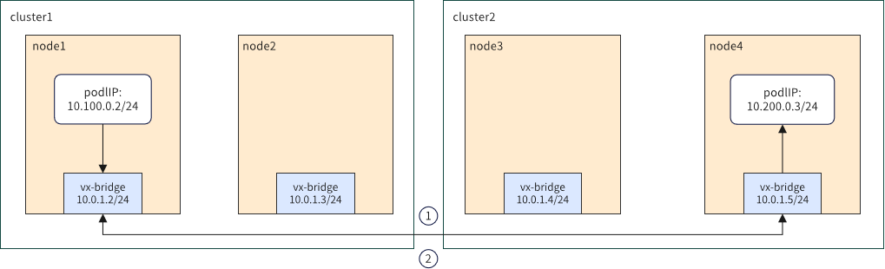

# 多集群网络联通

Kosmos 多集群解决方案的 Clusterlink 设计旨在互连多个 Kubernetes 集群的节点和资源，形成统一的资源池。
实现这一目标的基础之一是构建多集群网络架构，以满足不同集群之间的通信需求。

## 多集群容器网络解决方案

### 介绍
Clusterlink 包含两种网络模式：Gateway 和 P2P。
在 Gateway 模式下，当 Pod 发送数据包时，首先通过集群内的 vx-local 隧道到达该集群的 Gateway 节点，然后穿过跨集群隧道到达对端集群。
一旦数据包到达对端集群，由 CNI 处理并通过单集群网络到达目标 Pod。
这种模式的优点是每个集群只需要一个节点（或两个用于高可用性）提供外部访问，适用于多云和混合云场景。
缺点是由于较长的网络路径，存在一定的性能损失。为了应对这一问题，Clusterlink 提供了 P2P 模式，适用于对网络性能要求较高的场景。
在此模式下，数据包直接发送到目标 Pod 所在的节点。
此外，P2P 和 Gateway 模式可以组合使用。

### 设计
Kosmos 多集群网络 Gateway 解决方案的架构如下：


:::info 注意
提供了很强的兼容性，每个集群只需要一个节点（或两个用于高可用性）提供外部访问，适用于跨云场景。
:::

Kosmos 多集群网络 P2P 解决方案的架构如下：



:::info 注意
具有较短的网络路径和更好的性能，适用于完全互联的 Underlay 场景。
:::

### 先决条件

#### 安装 Kosmos
参考 Kosmos 快速入门文档 https://github.com/kosmos-io/kosmos 并启用 ClusterLink 模块以进行多集群网络配置。
使用 kosmosctl 工具：
```shell script
kosmosctl install --cni calico --default-nic eth0 // 我们根据参数 default-nic 传递的网络接口值建立网络隧道
```

#### 加入叶子集群
```shell script
kosmosctl join cluster --name cluster1 --kubeconfig ~/kubeconfig/cluster1-kubeconfig --cni calico --default-nic eth0 --enable-link
```

### 跨集群 L3 网络连接性
为了实现 Kosmos 中的跨集群 L3 网络连接性，需要至少两个不同集群的节点在主机网络层能够相互通信，并且集群必须正确部署并支持 VXLAN 或 IPSec 技术。

#### Gateway 模式
在 Kosmos 联邦中的每个 Kubernetes 集群中，使用 Elector 模块选举一个节点作为 Gateway（GW）节点。
两个集群的 GW 节点通过 vx-bridge 隧道（由 Kosmos 创建）进行通信以建立连接。
在每个集群内，路由由 GW 节点处理。
相比 P2P 模式，GW 模式由于 GW 节点的额外数据包封装和解封装，网络性能略低。
然而，其优势在于集群节点的路由表和 FDB 表几乎可以保持不变。
因此，GW 模式适用于对网络性能要求不高的更大规模多集群场景。

#### P2P 模式
在 P2P 模式下，不需要使用 Elector 模块。
Kosmos 在每个集群的所有节点上创建 vx-bridge 接口，实现不同集群节点之间的直接容器网络通信。
此模式下的网络性能几乎与单个 Kubernetes 集群相同。
然而，在 P2P 模式下，每个集群的每个节点需要为 Kosmos 联邦中的所有节点配置访问规则，导致较大的路由和 FDB 表大小。
因此，P2P 模式适用于对网络性能要求较高但每个集群节点数量较少的场景。

### 启动 ClusterLink

#### 使用 P2P 模式
```shell script
# 完成“安装 Kosmos”和“加入叶子集群”部分的步骤
# 检查集群资源是否正确创建
[root@kosmos-control-cluster yaml]# kubectl --kubeconfig config-14 get clusters.kosmos.io
NAME                     NETWORK_TYPE   IP_FAMILY
cluster38                p2p            all
kosmos-control-cluster   p2p            all

# 检查 clusternodes 资源是否正确创建
[root@kosmos-control-cluster yaml]# kubectl get clusternodes.kosmos.io
NAME                         ROLES         INTERFACE    IP
cluster38-001                              bond0.1820   10.*.*.38
cluster38-002                              bond0.1820   10.*.*.39
cluster38-003                              bond0.1830   10.*.*.94
cluster38-004                ["gateway"]   bond0.1830   10.*.*.95
kosmos-control-cluster-001                 bond0.1820   10.*.*.14
kosmos-control-cluster-002                 bond0.1820   10.*.*.15
kosmos-control-cluster-003   ["gateway"]   bond0.1565   10.*.*.38
kosmos-control-cluster-004                 bond0.1565   10.*.*.31
kosmos-control-cluster-005                 bond0.1565   10.*.*.32
kosmos-control-cluster-006                 bond0.1565   10.*.*.33
kosmos-control-cluster-007                 bond0.1565   10.*.*.37

# 检查 nodeconfigs 资源是否正确创建
[root@kosmos-control-cluster yaml]# kubectl get nodeconfigs.kosmos.io
NAME                         AGE
cluster38-001                14d
cluster38-002                14d
cluster38-003                14d
cluster38-004                14d
kosmos-control-cluster-001   48d
kosmos-control-cluster-002   48d
kosmos-control-cluster-003   49d
kosmos-control-cluster-004   49d
kosmos-control-cluster-005   45d
kosmos-control-cluster-006   45d
kosmos-control-cluster-007   45d
```

#### 创建测试 Pods
通过在 kosmos-control-cluster 和 cluster38 集群中创建 Pod 验证跨集群容器网络连接性。
为了确保容器具有常见的网络工具（如 Ping 和 Curl），使用 clusterlink-floater 镜像。
以下是创建 Pods 的示例 YAML：
```yaml
---
apiVersion: v1
kind: ServiceAccount
metadata:
  name: clusterlink-floater
  namespace: kosmos-system
---
apiVersion: rbac.authorization.k8s.io/v1
kind: ClusterRole
metadata:
  name: clusterlink-floater
rules:
  - apiGroups: ['*']
    resources: ['*']
    verbs: ["*"]
  - nonResourceURLs: ['*']
    verbs: ["get"]
---
apiVersion: rbac.authorization.k8s.io/v1
kind: ClusterRoleBinding
metadata:
  name: clusterlink-floater
roleRef:
  apiGroup: rbac.authorization.k8s.io
  kind: ClusterRole
  name: clusterlink-floater
subjects:
  - kind: ServiceAccount
    name: clusterlink-floater
    namespace: kosmos-system
---
apiVersion: apps/v1
kind: Deployment
metadata:
  name: clusterlink-floater
  namespace: kosmos-system
spec:
  replicas: 1
  selector:
    matchLabels:
      app: clusterlink-floater
  template:
    metadata:
      labels:
        app: clusterlink-floater
    spec:
      hostNetwork: false
      serviceAccountName: clusterlink-floater
      containers:
      - name: floater
        image: ghcr.io/kosmos-io/clusterlink-floater:v0.2.0-lts
        imagePullPolicy: IfNotPresent
        command:
          - clusterlink-floater
        securityContext:
          privileged: true
        env:
          - name: "PORT"
            value: "8889"
          - name: "ENABLE_ANALYSIS"
            value: "false"
      affinity:
        nodeAffinity:
          requiredDuringSchedulingIgnoredDuringExecution:
            nodeSelectorTerms:
              - matchExpressions:
                - key: kosmos.io/exclude
                  operator: DoesNotExist
      tolerations:
      - effect: NoSchedule
        operator: Exists
      - key: CriticalAddonsOnly
        operator: Exists
      - effect: NoExecute
        operator: Exists
```

:::info NOTE
本节提供的测试用例只能检查两个集群中节点之间的容器网络连接性。
要快速测试集群中的所有节点，请参阅第 5 节。
:::

确保 Pods 在 kosmos-control-cluster 和 cluster38 集群中成功运行：
````shell script
[root@kosmos-control-cluster yaml]# kubectl -n kosmos-system get pod
NAME                                              READY   STATUS    RESTARTS   AGE
clusterlink-agent-6qq4v                           1/1     Running   0          15d
clusterlink-agent-6v9jm                           1/1     Running   0          15d
clusterlink-agent-7zpf5                           1/1     Running   0          15d
clusterlink-agent-84d68                           1/1     Running   0          15d
clusterlink-agent-dj9q2                           1/1     Running   0          26h
clusterlink-agent-r2zj4                           1/1     Running   0          15d
clusterlink-agent-vlh2x                           1/1     Running   0          3d3h
clusterlink-controller-manager-6774ddd58b-bcn7s   1/1     Running   0          15d
clusterlink-elector-6b597b44f7-jrbg6              1/1     Running   0          15d
clusterlink-elector-6b597b44f7-mj882              1/1     Running   0          15d
clusterlink-floater-7dcb47579-lddgc               1/1     Running   0          77s
clusterlink-network-manager-6489597986-h74m4      1/1     Running   0          15d
clustertree-cluster-manager-6778bd7b6c-mwhpj      1/1     Running   0          5h45m
kosmos-operator-c88898f66-b8mjl                   1/1     Running   0          15d
kosmos-scheduler-7dcfd94bf7-2km8m                 1/1     Running   0          8d

[root@cluster38 yaml]# kubectl -n kosmos-system get pod
NAME                                              READY   STATUS    RESTARTS   AGE
clusterlink-agent-jsv2b                           1/1     Running   0          14d
clusterlink-agent-qncxt                           1/1     Running   0          14d
clusterlink-agent-rzngm                           1/1     Running   0          14d
clusterlink-agent-s252r                           1/1     Running   0          14d
clusterlink-controller-manager-77fbbd9f78-bz47t   1/1     Running   0          14d
clusterlink-elector-86b49775b5-x4gsp              1/1     Running   0          14d
clusterlink-elector-86b49775b5-z4lb5              1/1     Running   0          14d
clusterlink-floater-7dcb47579-jx85c               1/1     Running   0          16s
````

获取两个 Pod 的 IP 地址，并进入其中一个 Pod 的容器执行 Ping 命令，以验证跨集群的容器网络连接。示例如下：
````shell script
[root@cluster38 yaml]# kubectl -n kosmos-system get pod clusterlink-floater-7dcb47579-jx85c -oyaml |grep ip
  - ip: 10.*.*.253
  - ip: fd11:1111:*:*:*:*:4573:f17d

[root@kosmos-control-cluster yaml]# kubectl -n kosmos-system exec -it clusterlink-floater-7dcb47579-lddgc -- sh
/ # ping 10.*.*.253
PING 10.*.*.253 (10.*.*.253): 56 data bytes
64 bytes from 10.*.*.253: seq=0 ttl=62 time=0.592 ms
64 bytes from 10.*.*.253: seq=1 ttl=62 time=0.362 ms
64 bytes from 10.*.*.253: seq=2 ttl=62 time=0.388 ms
64 bytes from 10.*.*.253: seq=3 ttl=62 time=0.373 ms
^C
--- 10.*.*.253 ping statistics ---
4 packets transmitted, 4 packets received, 0% packet loss
round-trip min/avg/max = 0.362/0.428/0.592 ms
/ # ping -6 fd11:1111:*:*:*:*:4573:f17d
PING fd11:1111:*:*:*:*:4573:f17d (fd11:1111:*:*:*:*:4573:f17d): 56 data bytes
64 bytes from fd11:1111:*:*:*:*:4573:f17d: seq=0 ttl=62 time=0.679 ms
64 bytes from fd11:1111:*:*:*:*:4573:f17d: seq=1 ttl=62 time=0.492 ms
64 bytes from fd11:1111:*:*:*:*:4573:f17d: seq=2 ttl=62 time=0.406 ms
64 bytes from fd11:1111:*:*:*:*:4573:f17d: seq=3 ttl=62 time=1.488 ms
^C
--- fd11:1111:*:*:*:*:4573:f17d ping statistics ---
4 packets transmitted, 4 packets received, 0% packet loss
round-trip min/avg/max = 0.406/0.766/1.488 ms
````

### 一键诊断集群连接
集群连接诊断 (Floater) 功能旨在解决使用 Kosmos 时持续检查多个 Kubernetes 集群之间网络连接的挑战。当集群数量较少时，例如只有两个集群，这项任务可能并不困难。然而，当集群数量达到 5000 或更多时，即使是最热情的运维人员也会发现几乎不可能完成这项任务。

为了解决这个问题，我们设计了 Floater 功能，它可以在集群中的每个节点上漂浮。通过 kosmosctl 工具，您可以使用一个命令诊断多个 Kubernetes 集群之间的网络连接。
ClusterLink Floater 的架构如下：


kosmosctl 命令行工具提供了一键诊断命令 "dr"，可以轻松验证多个 Kubernetes 集群之间的网络连接，包括但不限于主机网络、容器网络和原生集群网络。示例如下：
````shell script
# 验证跨集群的主机网络
kosmosctl dr -r ghcr.io/kosmos-io/komos --src-kubeconfig root-config --dst-kubeconfig cluster38-config --host-network

# 验证跨集群的容器网络
kosmosctl dr -r ghcr.io/kosmos-io/komos --src-kubeconfig root-config --dst-kubeconfig cluster38-config
````