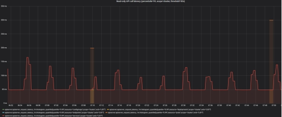

# Kosmos Performance Testing

## Network Performance Testing

The target of Kosmos networking is to establish connectivity between multiple Kubernetes clusters. This module can be deployed and used independently. In this document, we do performance testing on cross-cluster pod.

Bandwidth and latency are two import performance metrics. For bandwidth, we used iperf3 for testing, while ping was used to measure latency. 

The test environment consisted of three physical machines. Among these physical machines, two nodes on same subnet were deployed as a k8s cluster, and the other node on another subnet was separately deployed a k8s cluster. We established overley pod network connectivity between the two clusters using Kosmos.

environment：

+ kubernetes: `v1.21.5`

+ OS: `BigCloud Enterprise Linux For Euler release 21.10 (LTS-SP2)`

+ kernel: `4.19.90-2107.6.0.0192.8.oe1.bclinux.x86_64`

+ calico: `v3.23.2`

result：

| Test scenario                                 | bandwidth      | latency    |
| --------------------------------------------- | -------------- | ---------- |
| physical machines in same cluster             | 9.37 Gbits/sec | 0.091550ms |
| kubernetes overlay network（calico bgp)        | 8.15 Gbits/sec | 0.128268ms |
| kubernetes overlay network（calico tunl0）      | 6.34 Gbits/sec | 0.170805ms |
| kubernetes overlay network（calico vxlan）      | 6.25 Gbits/sec | 0.193439ms |
| physical machines in different cluster        | 9.35 Gbits/sec | 0.108512ms |
| cross-cluster overlay network（kosmos gateway） | 6.22 Gbits/sec | 0.332878ms |
| cross-cluster overlay network（kosmos p2p）     | 6.26 Gbits/sec | 0.218075ms |

It can be observed that the transmission through overlay container networks incurs certain losses compared to the transmission through underlay physical machine networks. It is also evident that the performance of our Kosmos network is essentially consistent with the network transmission performance within the Calico cluster.

By the way, when using kosmos to connect multiple Kubernetes clusters, network performance is better in p2p mode compared to gateway mode.

## Large scale cluster performance testing

Based on the standard configuration of Kubernetes large-scale clusters and user production implementation practices, the usage scenario of Kosmos managing 100000 nodes and 200000 Pods simultaneously was tested. Due to limitations in testing environment and tools, we have not pursued the upper limit of testing Kosmos multi cluster systems.

#### Performance indicators

How to determine if Kubernetes supports 100000+nodes? Is it supported even if 100000 nodes can be successfully registered in the cluster? Or what conditions?

The Kubernetes community has provided a series of SLIs (Service Level Indicator)/SLOs (service level objective) indicators to measure the quality of cluster services based on the judgment criteria. In a cluster, when the SLO of these SLIs is met, we say that the current Kubernetes cluster supports this performance metric.https://github.com/kubernetes/community/blob/master/sig-scalability/slos/slos.md

There are currently three official SLIs:

**API Call Latency**

| **Status** | **SLI**                                                      | **SLO**                                                      |
| ---------- | ------------------------------------------------------------ | ------------------------------------------------------------ |
| Official   | Single Object Mutating API P99 latency in the last 5 minutes | Except for aggregation API and CRD，P99 <= 1s                |
| Official   | Non streaming read only API P99 latency in the last 5 minutes | Except for aggregation API and CRD, Scope=resource,P99 <= 1sScope=namespace,P99 <= 5sScope=cluster,P99 <= 30s |

 

**Pod Startup Latency**

| Status   | **SLI**                                                      | SLO       |
| -------- | ------------------------------------------------------------ | --------- |
| Official | Stateless Pod startup time (excluding mirror removal and InitContainer), reporting startup time from Pod createTimestamp to all containers, and P99 time observed by the watch | P99 <= 5s |

#### Testing tools and test cases

##### 1. ClusterLoader2

ClusterLoader2 is an official open-source cluster load testing tool provided by Kubernetes, which can test the SLIs/SLOs indicators defined by Kubernetes to verify whether the cluster meets various service quality standards. In addition, Clusterloader2 provides visual data for cluster problem localization and cluster performance optimization. ClusterLoader2 will ultimately output a Kubernetes cluster performance report, displaying a series of performance indicator test results.

##### 2. Kwok

Kwok is a simulation testing toolkit officially released by Kubernetes, which allows users to create clusters with thousands of nodes in low resource simulation within seconds, and conduct large-scale testing of Kubernetes controllers without occupying a large amount of infrastructure. This report used the Kwok tool to simulate the creation of 20 Kubernetes clusters, each with 5000 nodes.

##### 3. Test cases

Use the Density test cases provided by ClusterLoader2( https://github.com/kubernetes/perf-tests/blob/master/clusterloader2/testing/density/config.yaml)。The detailed configuration of this report is shown in the table below:

| Type                         | Value   |
| ---------------------------- | ------- |
| Number of Nodes              | 100,000 |
| Number of Pods               | 200,000 |
| Number of Pods per node      | 2       |
| Number of Namespaces         | 200     |
| Number of Pods per Namespace | 1000    |

##### 4. Test clusters deploy architecture

 

 

#### Testing environment detail

The host Kubernetes is deployed using a single master, with Etcd, Kube apiserver, Kube Schedule, and Kube Controller all deployed as single instances.

##### 1. OS version

BigCloud Enterprise Linux For LDK release 7.6.1906 (Core)

kernel versions: 4.19.0-240.23.19.el7_6.bclinux.x86_64

Kubernetes version

Major:"1",Minor:"21+",GitVersion:"v1.21.5-eki.0",GitCommit:"83c85a6e50757c6bbb81c6ceaac60234c1161817",GitTreeState:"clean",BuildDate:"2021-10-19T08:28:00Z",GoVersion:"go1.16.8",Compiler:"gc", Platform:"linux/amd64"

##### 2. Master node

**CPU**

Architecture:     x86_64

CPU op-mode(s):    32-bit, 64-bit

Byte Order:      Little Endian

CPU(s):        48

On-line CPU(s) list:   0-47

Thread(s) per core:   2

Core(s) per socket:   12

Socket(s):       2

NUMA node(s):     2

Vendor ID:       GenuineIntel

CPU family:      6

Model:        85

Model name:      Intel(R) Xeon(R) Silver 4214 CPU @ 2.20GHz

Stepping:        7

CPU MHz:       2482.416

**MEMORY**： 187GB

##### 3. Component configuration

**kube-apiserver**

--max-requests-inflight=1000

--max-mutating-requests-inflight=1000

**kube-controller-manager **

--kube-api-qps=100

--kube-api-burst=100

 

**kube-scheduler **

--kube-api-qps=100

--kube-api-burst=200

 

**etcd **

--auto-compaction-retention=4

--quota-backend-bytes=8589934592

#### Test Results

**API Call Latency**

1. mutating API latency（threshold=1s）

 

 

2. Read-only API call latency(scope=resource, threshold=1s)

 

 

3. Read-only API call latency(scope=namespace, threshold=5s)

 

 

4. Read-only API call latency(scope=cluster, threshold=30s)

 

 

##### 2. **Pod Startup Latency**

| **metric**         | p50(ms) | p90(ms) | p99(ms) | **SLO(ms)** |
| ------------------ | ------- | ------- | ------- | ----------- |
| pod_startup        | 780     | 1189    | 1403    | 5000        |
| create_to_schedule | 0       | 0       | 1000    | N/A         |
| schedule_to_run    | 0       | 0       | 1000    | N/A         |
| run_to_watch       | 899     | 1375    | 1512    | N/A         |
| schedule_to_watch  | 764     | 1176    | 1376    | N/A         |

Note: In cases where the delay is relatively small, due to accuracy loss, certain values recorded by ClusterLoader2 are 0.

 

#### **Conclusion and Analysis**

In the above test results, both API Call Latency and Pod Startup Latency meet the SLIs/SLOs metrics defined by the Kubernetes community. Therefore, a multi cluster system with Kosmos as its core can stably support 100000 nodes online simultaneously and manage over 200000 pods.
