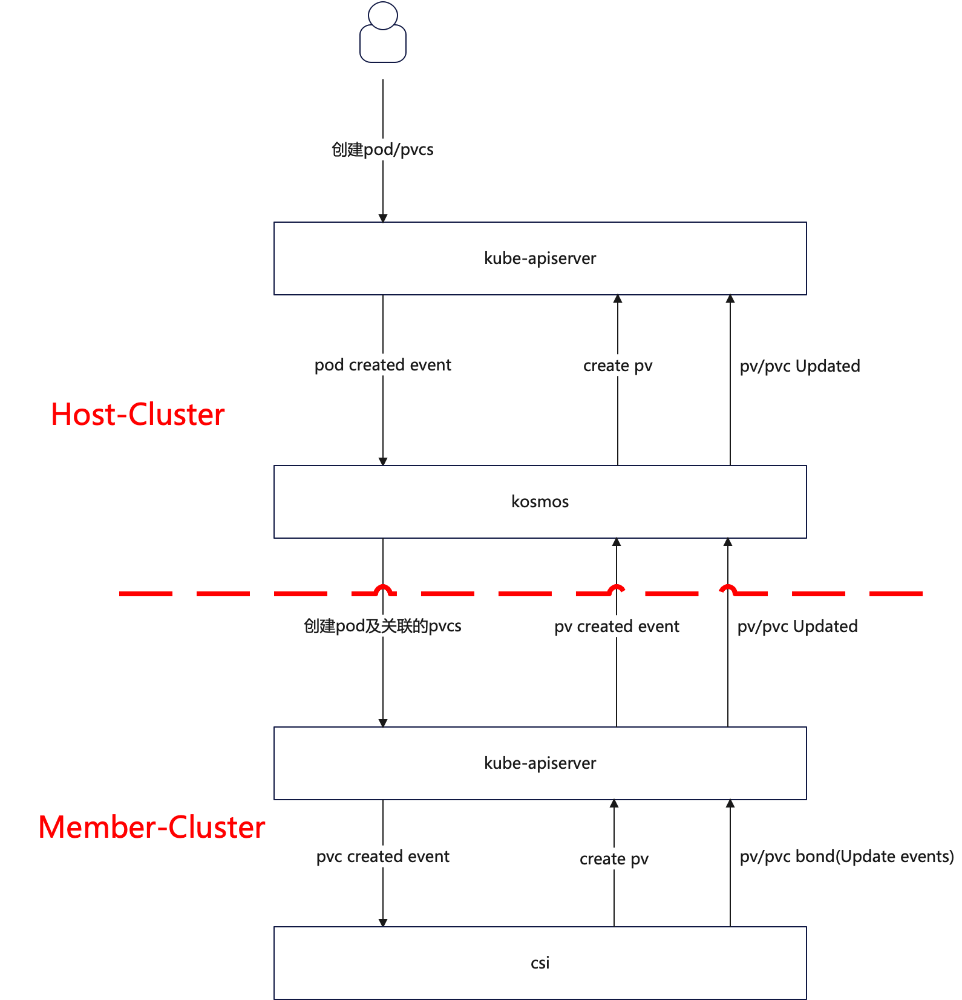

# Multi-cluster PV/PVC Dynamic Storage Solution

## Multi-cluster PV/PVC Dynamic Storage Implementation 

### Introduction
This document mainly introduces the implementation of PV/PVC storage management for stateful service-related Pods in Kosmos across clusters. 
It provides a detailed explanation of the processes involved in creating, updating, and binding PV and PVC for Pods. 
Through this document, you can gain a comprehensive understanding of the details of managing stateful services in Kosmos.

:::info NOTE
The current implementation is an intermediate version, and further optimization will be done for global storage.
:::

### Approach

#### Roles of PVC, PV, and SC in A Single Kubernetes Cluster
1. Persistent Volume (PV): 
- PV is a storage volume resource in a Kubernetes cluster that abstracts and separates it from the actual storage backend.
- PV can be any form of storage, such as network storage, local storage, cloud storage, etc.
- PVs can be pre-created by the PV administrator or dynamic storage plugins in the cluster. They can also be dynamically created to fulfill the requirements of PVC.
- PV describes storage attributes such as capacity, access modes (e.g., read/write), and reclaim policies.

2. Persistent Volume Claim (PVC): 
- PVC is the application's request for storage resources. It specifies the required storage capacity and other properties, such as access modes and volume modes, in the Pod.
- Applications use PVC to declare their storage requirements without specifying the actual storage location or type. Kubernetes matches PVC requirements with available PVs in the cluster to fulfill the PVC's needs.
- PVC can request dynamically provisioned matching PVs or manually select specific PV objects.

3. StorageClass (SC):
- SC defines the dynamic provisioning strategy for PVs. It specifies how to automatically create PVs based on PVC requirements.
- When a PVC requests a specific StorageClass, Kubernetes creates PV according to the rules defined in the StorageClass and automatically binds the PV to the PVC.
- StorageClass allows different types of storage to be defined, providing different storage options for different applications.

#### PVC, PV, StorageClass Implementation Process in A Single Kubernetes Cluster
- When a Pod in the application needs access to persistent storage, a PVC object is created to declare the desired storage.
- Based on the requirements defined in the PVC, Kubernetes matches it with suitable PVs through the StorageClass and binds them.
- After successful binding between PV and PVC, the application can directly use the storage provided by PVC and mount the storage path in the Pod.

#### StorageClass Volume Binding Modes
The 'volumeBindingMode' field in StorageClass definition specifies how the dynamic provisioner binds PVC and PV. 
Here are several common volume binding modes:
- Immediate: In this mode, the provisioner immediately binds an available PV to the PVC. If there are no available PVs matching the requirements of the PVC, the PVC remains in the Pending state.
- WaitForFirstConsumer: In this mode, the provisioner waits until a Pod referencing the PVC attempts to mount the volume before allocating a PV. The PV is dynamically bound when the PVC is consumed by the Pod.
- Cluster: This is the default binding mode. PV is immediately assigned to PVC. This mode is similar to Immediate, but it allows the cluster administrator to override the default binding mode of StorageClass. Each StorageClass can have only one binding mode, and once set, it cannot be changed.

Choose the appropriate binding mode based on your needs and environment configuration.

#### CSI (Dynamic Volume Provisioning) Related Process
1. User creates a Pod + PVC.
2. The VolumeController's PersistentVolumeController control loop detects the creation of PVC and skips it since it uses the Out-of-Tree mode. 
This control loop mainly handles PV and PVC binding in the In-Tree mode.
3. External-provisioner detects the creation of PVC:
- Calls the 'CreateVolume' method of the Controller Service to create the underlying storage volume. 
At this point, the volume is in the CREATED state and exists only in the storage system, not visible to any nodes or containers.
- Creates PV.
- Binds the PV to the PVC (binding: fills the name of this PV object in the spec.volumeName field of the PVC object).
4. The VolumeController's AttachDetachController control loop detects that the volume is not attached to the host and needs an Attach operation. 
It creates the 'VolumeAttachment' object.
5. When the external-attacher detects the creation of the 'VolumeAttachment' resource, it calls the 'ControllerPublishVolume' method of the Controller Service. 
At this point, the volume is in the NODE_READY state, meaning the Node can detect the volume but it is still invisible inside the container.
6. The Kubelet's VolumeManagerReconciler control loop:
- Performs the MountDevice operation by calling the 'NodeStageVolume' method of the Node Service. 
This method mainly handles formatting the volume and mounting it to a temporary directory (Staging directory). 
After this operation, the volume enters the VOL_READY state.
- Performs the SetUp operation by calling the 'NodePublishVolume' method of the Node Service. 
- It binds the Staging directory and mounts it to the corresponding host directory of the volume. 
- The volume enters the PUBLISHED state, and users can now use it normally.

#### Across-clusters Implementation 
Based on the above PVC, PV, StorageClass logic in a single Kubernetes cluster, and combined with the logic of creating Pod instances across clusters in Kosmos, the implementation approach for PV/PVC across clusters is as follows
- In the primary cluster (Host-Cluster), the volumeBindingMode of StorageClass is set to WaitForFirstConsumer, ensuring delayed binding and configuration of PV (waiting for synchronization with the member cluster) until a Pod using PersistentVolumeClaim is created. 
PersistentVolumes will be selected or configured based on scheduling constraints specified in Pod, including resource requirements, node selectors, pod affinities and anti-affinities, taints, and tolerations.
- PVC and PV binding in the primary cluster (Host-Cluster) should be consistent with the creation of Pods across clusters in Kosmos.
- The PV controller in the primary cluster (Host-Cluster) only handles PV deletion events, and creation and updates are operated by the PV controller in the member clusters.

### Flow
The implementation flow of Kosmos PV/PVC is as follows:



- When a Pod is created in the primary cluster (Host-Cluster) and there is an associated PVC request, Kosmos will create the corresponding PVC in the member cluster based on the Pod creation event.
- After the PVC is created in the member cluster (Member-Cluster), the process follows the same flow as in a single Kubernetes cluster, including completion of Pod creation, PVC creation, PV creation, and PVC-PV binding.
- When PV is created in the member cluster (Member-Cluster), the corresponding PV controller will create the PV in the primary cluster (Host-Cluster) based on the PV creation event.
- After successful scheduling in the member cluster (Member-Cluster) and binding of PVC and PV, the PV creation in the primary cluster (Host-Cluster) completes the binding of PVC and PV.

### Related

#### Scheduling Module (Host-Cluster)
This module can be implemented by extending the VolumeBinding plugin in the Kosmos Scheduler. 
It can be achieved by using a virtual node with the taint "kosmos.io/node=true:NoSchedule".

#### Orchestration Module
This module's implementation is mainly based on the steps described in Section 3, including root_pod_controller.go, root_pvc_controller.go, leaf_pvc_controller.go, root_pv_controller.go, and leaf_pv_controller.go in the cluster-manager of Kosmos.

### Demo
1. YAML Example: 
````shell script
apiVersion: v1
kind: PersistentVolumeClaim
metadata:
  name: nginx-pvc
  namespace: test-new
spec:
  accessModes:
  - ReadWriteOnce
  resources:
    requests:
      storage: 1Gi
  storageClassName: openebs-hostpath
---
apiVersion: apps/v1
kind: Deployment
metadata:
  name: nginx-new
  namespace: test-new
spec:
  selector:
    matchLabels:
      app: nginx
  replicas: 1
  template:
    metadata:
      labels:
        app: nginx
      deletionGracePeriodSeconds: 30
    spec:
      affinity:
        nodeAffinity:
          requiredDuringSchedulingIgnoredDuringExecution:
            nodeSelectorTerms:
              - matchExpressions:
                  - key: kubernetes.io/hostname
                    operator: In
                    values:
                      - kosmos-cluster38
      tolerations:
      - key: "kosmos.io/node"
        operator: "Equal"
        value: "true"
        effect: "NoSchedule"
      containers:
      - name: nginx
        image: registry.paas/cnp/nginx:1.14-alpine
        ports:
        - containerPort: 80
        volumeMounts:
        - name: data
          mountPath: /data
      volumes:
      - name: data
        persistentVolumeClaim:
          claimName: "nginx-pvc"
````

2. Executing the creation operation in the Host cluster: 
````shell script
[root@cnp-paas-ecsc-001 ylc]# kubectl apply -f test.yaml
persistentvolumeclaim/nginx-pvc created
deployment.apps/nginx-new created
[root@cnp-paas-ecsc-001 ylc]#
[root@cnp-paas-ecsc-001 ylc]# kubectl get all -n test-new
NAME                             READY   STATUS    RESTARTS   AGE
pod/nginx-new-5677468b6c-ns9k2   0/1     Pending   0          5s

NAME                        READY   UP-TO-DATE   AVAILABLE   AGE
deployment.apps/nginx-new   0/1     1            0           5s

NAME                                   DESIRED   CURRENT   READY   AGE
replicaset.apps/nginx-new-5677468b6c   1         1         0       5s
[root@cnp-paas-ecsc-001 ylc]# kubectl get all -n test-new -owide
NAME                             READY   STATUS    RESTARTS   AGE   IP              NODE               NOMINATED NODE   READINESS GATES
pod/nginx-new-5677468b6c-ns9k2   1/1     Running   0          11s   10.224.12.252   kosmos-cluster38   <none>           <none>

NAME                        READY   UP-TO-DATE   AVAILABLE   AGE   CONTAINERS   IMAGES                                SELECTOR
deployment.apps/nginx-new   1/1     1            1           11s   nginx        registry.paas/cnp/nginx:1.14-alpine   app=nginx

NAME                                   DESIRED   CURRENT   READY   AGE   CONTAINERS   IMAGES                                SELECTOR
replicaset.apps/nginx-new-5677468b6c   1         1         1       11s   nginx        registry.paas/cnp/nginx:1.14-alpine   app=nginx,pod-template-hash=56774
[root@cnp-paas-ecsc-001 ylc]# kubectl get pvc -n test-new
NAME        STATUS   VOLUME                                     CAPACITY   ACCESS MODES   STORAGECLASS       AGE
nginx-pvc   Bound    pvc-ad86ef86-23c1-407e-a8e7-0b3e44d36254   1Gi        RWO            openebs-hostpath   21s
````

3. Querying the status in the Member cluster: 
````shell script
[root@cnp-paas-ecsc-004 ~]# kubectl get all -n test-new
NAME                             READY   STATUS    RESTARTS   AGE
pod/nginx-new-5677468b6c-ns9k2   1/1     Running   0          2m36s
[root@cnp-paas-ecsc-004 ~]# kubectl get pvc -n test-new
NAME        STATUS   VOLUME                                     CAPACITY   ACCESS MODES   STORAGECLASS       AGE
nginx-pvc   Bound    pvc-ad86ef86-23c1-407e-a8e7-0b3e44d36254   1Gi        RWO            openebs-hostpath   2m41s
````

### Conclusion
The dynamic storage implementation of PV/PVC in Kosmos needs to be extended to support global storage. 
The current implementation has a smaller granularity. Further improvements and evolution are needed.