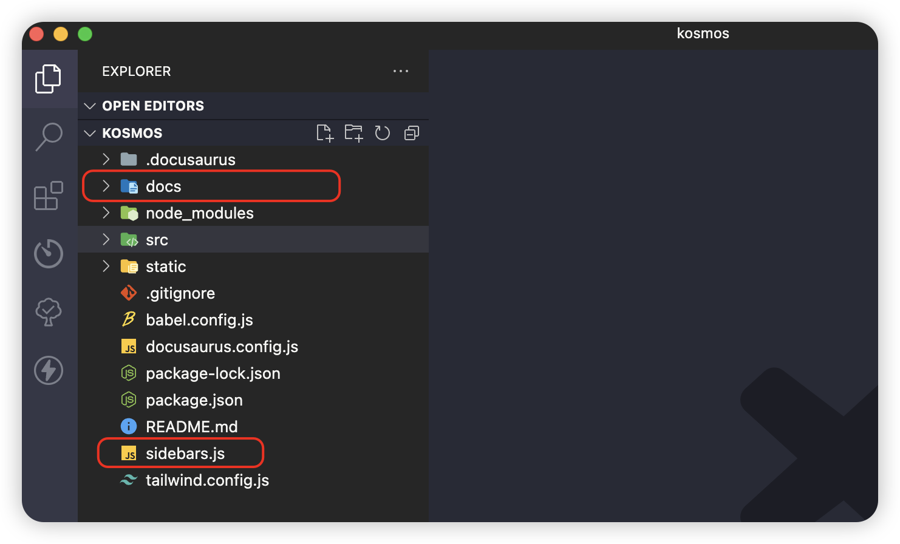
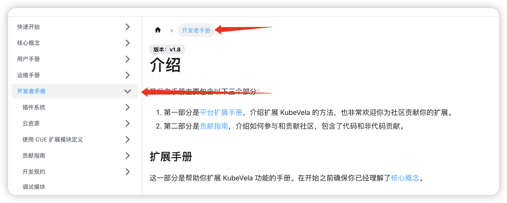

import Tabs from '@theme/Tabs';
import TabItem from '@theme/TabItem';

## 1.项目中常用文件和文件夹介绍


:::info 说明
主要用到`docs文件夹`和`sidebars.js文件`,以下是注意点介绍
<Tabs>
<TabItem value="docs文件夹" label="docs文件夹">
```bash
1.docs文件夹为固定文件夹不能重命名.
2.需要显示的文档如md,mdx文件需要存放到docs目录下面.
3.文档中使用到的资源例如图片等也可以放在docs下面.(建议新建一个文件夹来存放除了文档外的资源)
```
</TabItem>

<TabItem value="sidebars.js文件" label="sidebars.js文件">
```bash
1.sidebars.js文件为固定文件不能重命名.
2.该文件主要用来配置左侧目录以及对应右侧显示的文档内容
```
</TabItem>
</Tabs>
:::

## 2.md/mdx文件写法
> 请点击 ->  [md/mdx文件写法](./example/文档写法介绍.md)

## 3.开始新建文档

### 1.在docs目录下面新建md或者mdx文件
> 这里以md文档为例新一个`测试.md`文件


### 2.文档头部固定写法

```
---
id: testMd
title: '测试文档'
---
```
:::tip 说明
1.`id` 文档的唯一标识,独一无二不能出现重复.

2.`title`: 文档的标题在页面左侧目录和文档内容顶部显示, 如果左侧目录需要显示不同的标题可以在`sidebars.js`文件中单独配置.

:::

### 3.配置目录显示文档
> 在`sidebars.js`文件中配置


:::tip 说明
1.`id` 为写的文档顶部的id.

2.`type`: 文档固定为`doc`

特殊说明:

1.假设该文件目录在docs下面一个`test文件夹`下面时,在`sidebars.js`文件中配置时`id`要写成`文件夹名称`+`/`+`文档的id` 

```
id: 'test/testMd'
```

2.这边可以单独配置label来显示左侧显示的标题


:::

### 4.刷新页面即可显示内容


## 4.创建目录整理文档
### 1.点开后展示一下目录内容显示点击前的页面
> 第一种折叠效果, 以下面`第一种目录折叠`为例


> 配置如图


### 2.点击后内容显示该目录下的文件快速链接
> 第二种常用效果:


> 以下面`第二种目录折叠`为例


> 配置如图


### 3.点击后内容显示目录的对应文档并打开折叠
> 第三种常用效果:


> 以下面`第三种目录折叠`为例


> 目录对应显示的内容文档


> 配置如图


